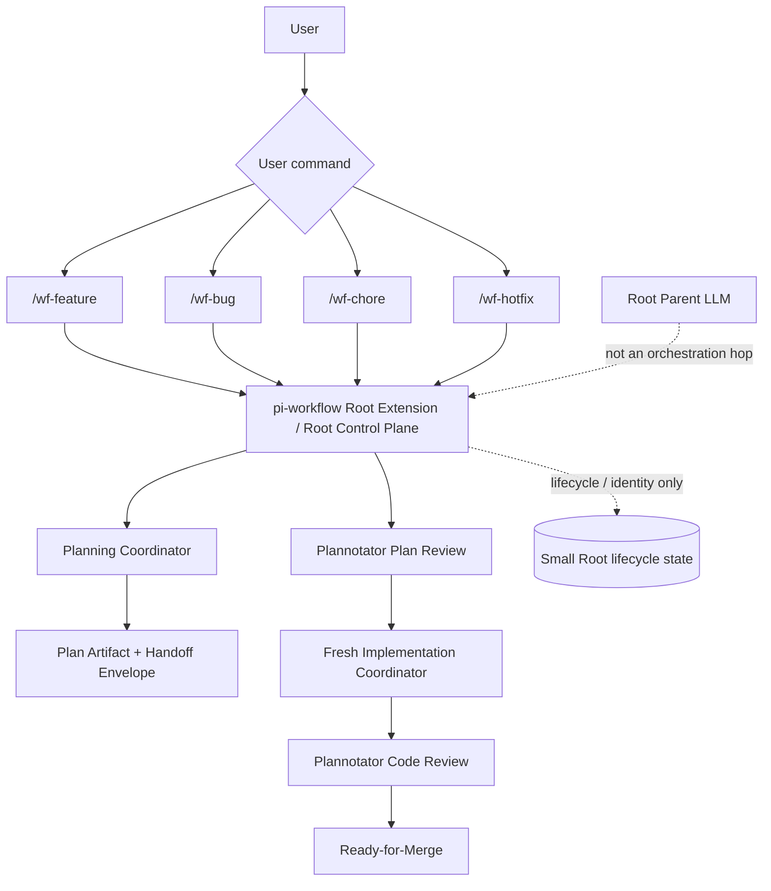
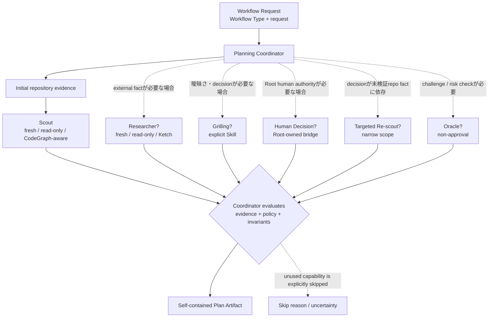
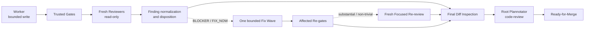
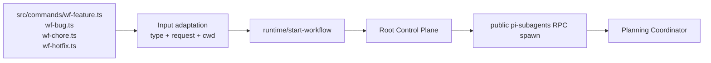
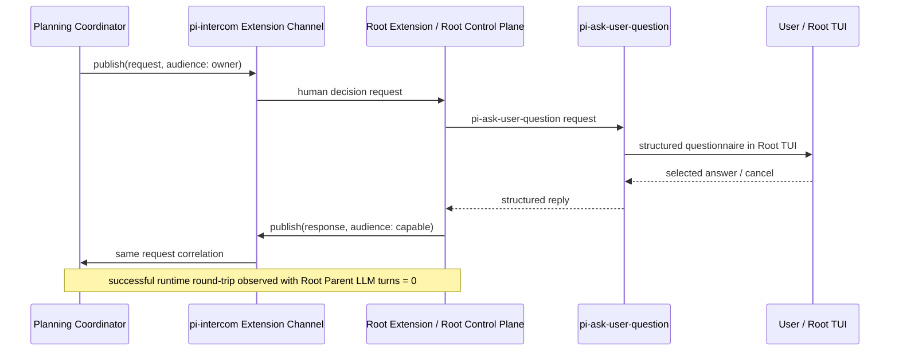
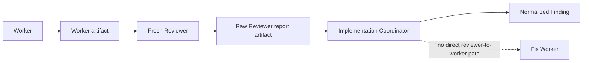
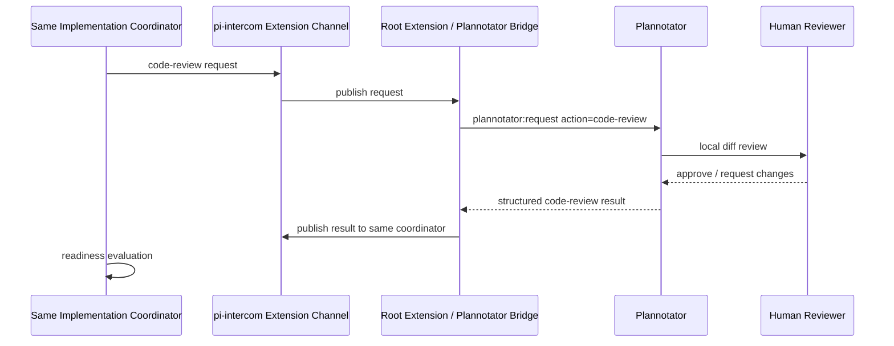
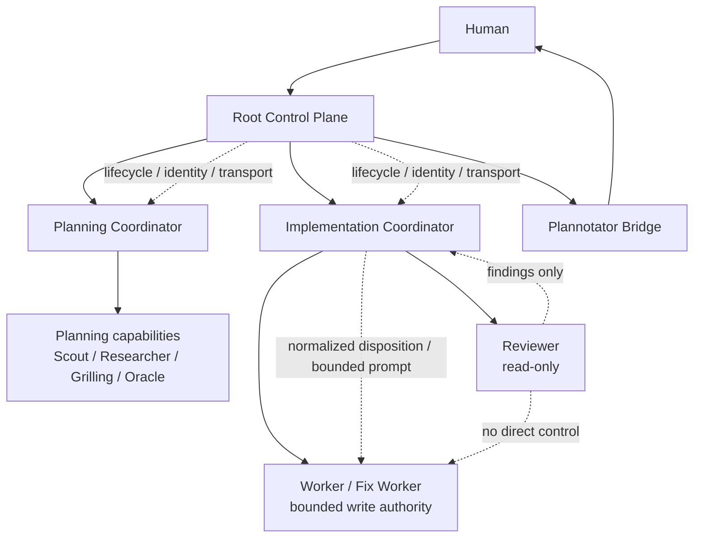
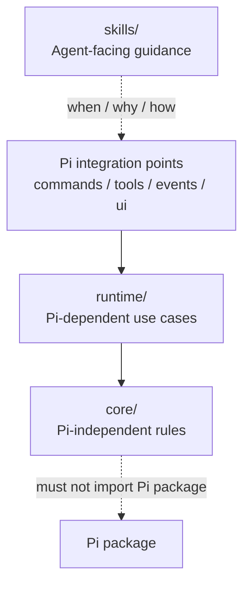

# pi-workflow Architecture Design

_Runtime-validated architecture for Pi change workflows_

- **Document status**: Architecture Design Document
- **Project / package**: `pi-workflow`
- **Primary evidence repository**: `/Users/minoru/Documents/mywork/pi-subagents-smoke`
- **Legacy source**: `/Users/minoru/Documents/mywork/change-workflow-legacy/`
- **Pi baseline**: `0.85.1`
- **pi-subagents baseline**: `v0.68.0`
- **pi-subagents revision**: `f3ccf47dc236b6c0fcc0d897cec4a9e6da3e916d`
- **Historical regression verification**: `d9864f8288152e83270f62090d7d66eb5ff729bb`（v0.67系の検証履歴。current baselineではない）
- **Directory structure basis**: `/Users/minoru/Documents/mywork/pi-extension-skill-directory-structure.md`

本書は、runtimeで確認済みのcapability、現行source、public mechanism、および指定されたExtension + Skill directory structureを根拠にしたproduction `pi-workflow` のarchitectureを定義する。Production implementation、repository作成、追加Smoke Testは本書の範囲外であり、本作業では開始していない。

---

## 1. Executive Summary

`pi-workflow` は、Pi packageとして配布するRoot Extensionと、必要なAgent-facing Skillから構成する。ユーザー向けのentry pointは次の4つである。

```text
/wf-feature <request>
/wf-bug <request>
/wf-chore <request>
/wf-hotfix <request>
```

Commandは巨大なworkflow promptをRoot Parent LLMへ送らない。Command handlerはRoot ExtensionのControl Planeへrequestを渡し、Root Extensionがpublic `pi-subagents` RPCで非同期のPlanning Coordinatorを起動する。

```text
/wf-*
  → Root Extension / Root Control Plane
  → public pi-subagents RPC spawn
  → Planning Coordinator
```

Root Parent LLMは、workflow orchestrator、workflow state holder、phase transport、planning synthesis、review finding ownerではない。Full Workflow Smokeでは、Root Parent LLMのinternal turns `0`、Root transcriptへのraw report流入なし、Root Extension主体のphase transitionがruntimeで確認されている。

Planningは、`Workflow Type`、request内容、repository evidence、曖昧さ、external factの必要性、risk、scope、および`Workflow Policy`に基づくconditional graphである。Full Smokeで通過した

```text
Scout → Researcher → Grilling → Human Decision → Targeted Re-scout → Oracle → Plan
```

は、capability compositionを確認したtest flowであって、全Workflow Typeのmandatory pipelineではない。

Planのcanonical execution contentは`implementation-plan.md`、Planning Coordinatorが完了時に生成するimmutableなPlanning metadataは`planning-handoff.json`とする。Rootはplan content identityをhashで検証し、Plannotatorのplan approvalを同じidentityへbindする。approval後はPlanning Coordinatorをresume/forkせず、freshなImplementation CoordinatorへPlan Artifact、Planning Handoff、Root-owned Approval Identityを渡す。

Implementationでは、Workerがbounded write authorityを持つ。Reviewerはfresh contextかつread-onlyであり、findingのnormalize/dispositionはImplementation Coordinatorが行う。Accepted findingsはboundedなFix Waveへまとめ、affected Trusted Gateと必要なFocused Re-reviewを経てから、Root-ownedなPlannotator code reviewへ進む。Ready-for-Mergeはfail-closedとする。

---

## 2. Goals

### 2.1 Architecture goals

- `change-workflow`と呼ばれてきた構成を正式に`pi-workflow`として再定義する。
- `/wf-feature`、`/wf-bug`、`/wf-chore`、`/wf-hotfix`をfirst-classなWorkflow request entryとして維持する。
- `/wf-*`からRoot Parent LLMへ巨大promptを送らず、Root ExtensionをControl Planeとする。
- `Workflow Type`をlifecycleとPlanning-stage selectionの入力にする。
- requestやrepository evidenceに応じたvariable planning flowを表現する。
- PlanningとImplementationを別Coordinator runとして分離する。
- Human interactionとPlannotator transportをRoot-ownedにする。
- approved plan identity、Handoff Envelope、artifact referenceを使ってphase boundaryを明示する。
- Worker、Reviewer、Implementation Coordinatorのauthorityを分離する。
- Raw child outputをRoot Parent model contextへ流さず、managed artifactとsmall structured stateで連携する。
- Ready-for-Mergeを、approval・identity・gate・reviewの全条件が揃ったときだけ成立させる。
- 指定されたExtension + Skill directory structureをproduction packageのbasisにする。

### 2.2 Evidence goals

重要なarchitecture claimを、次の優先順で説明可能にする。

1. Runtime smoke evidence
2. Current source implementation
3. Official documentation / public specification
4. Legacy `change-workflow` source
5. Design inference

各decisionには、可能な限り`Runtime-confirmed`、`Source-confirmed`、`Spec-confirmed`、`Design decision`、`TBD`のstatusを付ける。

---

## 3. Non-Goals

今回、以下は確定しない。

- Production `pi-workflow` repositoryの作成。
- Extension、Skill、tests、fixtures、legacy sourceの変更。
- 新しいSmoke Test、runtime probe、fixtureの追加・実行。
- exact class name、function signature、JSON schema version。
- Workflow Typeごとのmandatory stage matrixやdefault profile。
- `feature`、`bug`、`chore`、`hotfix`の詳細なstage trigger / skip criteria。
- Grilling、Researcher、OracleのWorkflow Type別mandatory条件。
- exact retry count、timeout、persistence technology、retention policy。
- fixed progress card、stage percentage、`workflow_status` polling UI、旧`workflow-tui.ts` layout。
- concrete monitoring/status UI。
- merge、push、release、deployをchildが実行する運用。
- private/internal Pi APIへの依存を新たに導入すること。

---

## 4. Terminology and Naming

### 4.1 Canonical names

| Term | Meaning |
| --- | --- |
| `pi-workflow` | 新しいproject/package/architectureの正式名称。 |
| legacy `change-workflow` | `/Users/minoru/Documents/mywork/change-workflow-legacy/`にあるreference implementation。 |
| `Workflow Type` | `feature`、`bug`、`chore`、`hotfix`のfirst-class request type。 |
| `Workflow Policy` | Workflow Typeとrequest/evidenceに対するmachine-enforced invariantとstage-selection boundary。 |
| `Root Control Plane` | Root Extensionが持つtop-level lifecycle、phase、identity、transport、cancellationの制御面。 |
| `Root Extension` | Root Pi processで動く`pi-workflow` Extension。 |
| `Root Parent LLM` | Root sessionのLLM。workflow orchestrationやstate ownershipは持たない。 |
| `Planning Coordinator` | Planning phaseのorchestration、stage selection、plan compositionを担うCoordinator run。 |
| `Implementation Coordinator` | approved planに基づく実装、gate、review、finding、fix、readinessを担うCoordinator run。 |
| `Human Decision Bridge` | CoordinatorとRoot TUIの間をRoot-owned transportで接続するbridge。 |
| `Plannotator Bridge` | Root ExtensionからPlannotator shared event APIへ接続するtransport。 |
| `Plan Artifact` | canonical execution contentである`implementation-plan.md`。 |
| `Handoff Envelope` | Planning Coordinatorが完了時に生成するimmutableな`planning-handoff.json`。Planning-owned metadataだけを持つ。 |
| `Trusted Gate` | repositoryが宣言したverification commandと、その`PASS`等のstatus/evidence。 |
| `Finding` | Reviewerやvalidatorのraw outputからnormalizeされたissue。 |
| `Disposition` | Findingの`BLOCKER`、`FIX_NOW`、`DEFERRED`、`REJECTED`分類。 |
| `Fix Wave` | accepted findingを1つのbounded promptへまとめた修正実行単位。 |
| `Focused Re-review` | substantial / non-trivial fix後にfresh Reviewerで対象findingを確認するstage。 |
| `Ready-for-Merge` | 全mandatory conditionを満たしたfail-closedな最終eligibility。 |

### 4.2 Naming rules

```text
Package / project: pi-workflow
Commands: /wf-feature, /wf-bug, /wf-chore, /wf-hotfix
TypeScript files: kebab-case.ts
functions: camelCase
types / interfaces: PascalCase
独自Skill: pi- prefix
upstream Skill: 既存名を維持（例: grilling, tdd, ponytail, codegraph）
```

`change-workflow`という名前はlegacy sourceを指す場合だけ使い、新architectureや新packageを指す曖昧なshort nameとしては使わない。

---

## 5. Background / Problems with Legacy `change-workflow`

### 5.1 Legacy source inspected

以下を直接確認した。

- `/Users/minoru/Documents/mywork/change-workflow-legacy/SKILL.md`
- `/Users/minoru/Documents/mywork/change-workflow-legacy/workflow-tui.ts`

Legacy repositoryはCodeGraph未初期化だったため、CodeGraphを初期化せず、限定したsource inspectionで確認した。既存のSmoke report内のCodeGraph runtime evidenceは別途利用した。

### 5.2 Legacy behavior that is useful to preserve

`SKILL.md`のrequest contractは、request ID、request type、request、cwdをworkflowへ渡す。`workflow-tui.ts:436-454`は`/wf-feature`等のUX、空requestの拒否、active workflowの重複拒否、開始通知を実装している。これらはuser-facing intentとして維持対象である。

Legacy sourceからconceptually維持するものは次のとおり。

- `/wf-*`のuser-facing command UX。
- request typeとrequest内容を明示してworkflowを開始すること。
- explicit plan approval boundary。
- explicit code review boundary。
- plan rejection feedbackを受けたresubmission semantics。
- final code reviewがapprovedでなければ`ready-for-merge`にしないfail-closed semantics。
- Worker、fresh Reviewer、single bounded fix、affected checksという実行上の考え方。

### 5.3 Legacy pattern to remove

`workflow-tui.ts:413-434`の`workflowPrompt()`は、全planning/implementation orchestration instructionsを1つの巨大promptへ組み立てる。`workflow-tui.ts:449-452`はcommand handlerから`pi.sendUserMessage(workflowPrompt(...))`を呼び、Root Parent LLMをorchestration経路へ入れる。

これは`pi-workflow`で禁止する。

```text
/wf-*
  ✗ workflowPrompt(...)
  ✗ pi.sendUserMessage(...)
  ✗ Root Parent LLMがorchestration
```

`workflow-tui.ts:457-497`の`workflow_status`はdisplay-onlyのstatus toolであり、lifecycle authorityではない。`workflow-tui.ts:855-898`はprocess-local eventを受けて`status.json`を500ms pollingし、`workflow-tui.ts:140-290`は固定7-cardとstage-local progressを描画する。これらはlegacy UI implementationであって、new architectureのstate authorityやmandatory UIではない。

`workflow-tui.ts:499-711`のplan review、`workflow-tui.ts:712-830`のcode reviewはsemanticsを参考にするが、transportはRoot Extensionのdirect Plannotator Bridgeへ移す。特にcode review前の`plan-mode` status precheckは、current Plannotator sourceとruntime evidenceに基づき削除する。

### 5.4 Problem statement

Legacyは、次の異なる責務をParent sessionと`workflow-tui.ts`に集中させている。

```text
command registration
prompt-based orchestration
workflow state interpretation
TUI rendering
Plannotator transport
plan approval waiting
code approval waiting
native subagent event observation
finding/fix orchestration guidance
```

`pi-workflow`はこれを、Root Control Plane、Planning Coordinator、Implementation Coordinator、Worker、Reviewer、Root bridges、artifact/coreへ分解する。Legacy sourceはbehavior reference、migration source、problem evidenceであり、そのstructureをコピーするrequirementではない。

**Status**: Legacy behaviorはSource-confirmed。新しい責務分割はRuntime evidenceを反映したDesign decision。

---

## 6. Evidence Basis

### 6.1 Evidence status vocabulary

| Status | Meaning |
| --- | --- |
| `Runtime-confirmed` | 指定runtimeで実際のlaunch、transport、completion、ownership、またはfailure gateを観測した。 |
| `Source-confirmed` | 現行sourceを読み、API名、責務、実装経路を確認した。 |
| `Spec-confirmed` | Pi、pi-subagents、directory structure等のpublic documentation/specで確認した。 |
| `Design decision` | evidenceから導くproduction architecture上の選択。runtime事実そのものではない。 |
| `TBD` | Implementation Specificationまたはoperational policyで決める未確定事項。 |

### 6.2 Required Smoke reports

本書が参照するreportは次のとおりである。

- [`docs/phase-a-smoke-results.md`](phase-a-smoke-results.md)
- [`docs/b0-investigation-results.md`](b0-investigation-results.md)
- [`docs/b0-2-ketch-tool-loss.md`](b0-2-ketch-tool-loss.md)
- [`docs/pr-2143-ketch-verification.md`](pr-2143-ketch-verification.md)
- [`docs/grilling-nested-capability-results.md`](grilling-nested-capability-results.md)
- [`docs/human-bridge-tui-results.md`](human-bridge-tui-results.md)
- [`docs/plannotator-direct-api-results.md`](plannotator-direct-api-results.md)
- [`docs/v068-worker-reviewer-capability-results.md`](v068-worker-reviewer-capability-results.md)
- [`docs/implementation-composition-results.md`](implementation-composition-results.md)
- [`docs/phase-handoff-capability-results.md`](phase-handoff-capability-results.md)
- [`docs/full-workflow-composition-results.md`](full-workflow-composition-results.md)
- [`docs/human-bridge-capability-results.md`](human-bridge-capability-results.md)

`human-bridge-capability-results.md`の旧成功未確認結果ではなく、実TUI round-tripがPASSとなった`human-bridge-tui-results.md`をHuman Decisionの成功経路のprimary evidenceとする。

### 6.3 Current public mechanism sources

本書のpublic mechanism名は、次のcurrent source/documentationとSmoke reportを突き合わせた。

| Mechanism | Current source / specification |
| --- | --- |
| Pi Extension API | `/Users/minoru/.local/share/mise/installs/pi/0.85.1/docs/extensions.md` |
| Pi RPC mode | `/Users/minoru/.local/share/mise/installs/pi/0.85.1/docs/rpc.md` |
| Pi packages | `/Users/minoru/.local/share/mise/installs/pi/0.85.1/docs/packages.md` |
| Pi Skills | `/Users/minoru/.local/share/mise/installs/pi/0.85.1/docs/skills.md` |
| Pi session / custom entries | `/Users/minoru/.local/share/mise/installs/pi/0.85.1/docs/session-format.md` |
| `pi-subagents` Extension RPC | `/Users/minoru/.pi/agent/npm/node_modules/pi-subagents/docs/extension-api.md` |
| `workflowScript`, `runs.run`, `runs.all` | `/Users/minoru/.pi/agent/npm/node_modules/pi-subagents/docs/workflows.md`、`tool-reference.md` |
| async artifacts / completion events | `/Users/minoru/.pi/agent/npm/node_modules/pi-subagents/docs/observability.md` |
| Plannotator request actions | `/Users/minoru/.pi/agent/npm/node_modules/@plannotator/pi-extension/plannotator-events.ts` |
| `pi-ask-user-question` questionnaire | `/Users/minoru/.pi/agent/git/github.com/minorunakamura/pi-ask-user-question/src/` |
| `pi-intercom` Extension Channel | Human bridge Smoke reportでsource/APIを確認。`IntercomExtensionChannel.publish()`と`IntercomExtensionRegistration.onEvent()`を使用する。 |

### 6.4 Baseline note

Phase A/B0と一部nested capability reportはv0.67.0またはhistorical candidateである。これらはpublic RPC、artifact、notification suppression、nested routingの履歴evidenceとして扱う。Production baselineはv0.68.0であり、v0.68.0 reportでResearcher + Ketch、nested supervisor、Worker、Reviewer、TDD、Parent wake isolationを再確認している。

`d9864f8288152e83270f62090d7d66eb5ff729bb`はv0.67系のKetch regression fix candidate検証履歴であり、current baseline requirementにはしない。v0.68.0の正式revisionは`f3ccf47dc236b6c0fcc0d897cec4a9e6da3e916d`である。

---

## 7. Architecture Principles

1. **Root Extension is the Control Plane** — lifecycle、phase、identity、transport、cancellationをRoot Extensionが持つ。
2. **Root Parent LLM is not the orchestrator** — workflowをpromptで駆動しない。
3. **Workflow Type is first-class** — command aliasではなく、policy/lifecycleへの入力である。
4. **Planning is a conditional graph** — Full Smokeの順序をuniversal pipelineにしない。
5. **Coordinator owns selection, not arbitrary topology invention** — boundedなcapability/policyの範囲で選ぶ。
6. **Artifacts over context injection** — large reportやtranscriptをParent model contextへ戻さない。
7. **Approval binds to identity** — approved planとconsumed planが同一content identityであることを検証する。
8. **Fresh phase ownership** — PlanningとImplementationは別Coordinator runである。
9. **Least authority** — read-onlyの役割にwrite authorityを与えず、Workerのscopeをboundedにする。
10. **Review is advisory until dispositioned** — Reviewerはfindingを出すが、fix命令やacceptance authorityを持たない。
11. **Root-only human transport** — childの`ctx.ui`やprocess-local `pi.events`をRoot TUI transportとして使わない。
12. **Fail closed** — approval、hash、handoff、mandatory / required gate、review、bridgeが不明なら次phaseやReady-for-Mergeへ進まない。Optional Gateの`SKIPPED`は、それだけではblockしない。
13. **Skill and Extension are not duplicate implementations** — Skillは判断 guidance、Extensionはmechanical executionである。
14. **Evidence before invention** — 未確認のrecovery、matrix、retry、UIを事実として記述しない。

---

## 8. System Context

### 8.1 Diagram A — System Context

ユーザーは4つの`/wf-*` commandのいずれかでWorkflow requestを開始する。Root Extensionはrequestをparseし、`Workflow Type`を確定し、Root lifecycleを作り、public `pi-subagents` RPCでPlanning Coordinatorを起動する。Root Parent LLMはこのtransportに参加しない。



### 8.2 Top-level path

```text
User
  → /wf-*
  → Root Extension
  → create workflow lifecycle
  → public pi-subagents RPC spawn
  → Planning Coordinator
  → Plan Artifact / Handoff Envelope
  → Root integrity + direct Plannotator plan-review
  → fresh Implementation Coordinator
  → Worker / Gates / Review / Fix
  → direct Plannotator code-review
  → Ready-for-Merge or fail-closed terminal result
```

**Status**: RPC launch、artifact、plan approval、phase handoff、implementation composition、code approval、ready gateはruntime evidenceで確認済み。最終的なRoot Control Planeのproduction API分割はDesign decisionである。

---

## 9. Workflow Types and Variable Flow

### 9.1 Workflow Type

概念上のtypeは次の4値である。

```ts
// Conceptual only; exact TypeScript definition is Implementation Specification scope.
type WorkflowType =
  | "feature"
  | "bug"
  | "chore"
  | "hotfix";
```

`/wf-feature`等は単なる同一pipelineのaliasではなく、`Workflow Type`を持つWorkflow requestを生成する。

### 9.2 Flow selection inputs

Planning topologyは少なくとも次の入力を受ける。

```text
Workflow Type
request内容
repository evidence
仕様の曖昧さ
known / unknown事項
external factの必要性
risk
変更scope
Workflow Policy
Common invariants
```

### 9.3 Diagram B — Variable Planning Flow

`Scout`、`Researcher`、`Grilling`、`Human Decision`、`Targeted Re-scout`、`Oracle`のうち、必要なcapabilityだけをboundedに選ぶ。特にResearcherやGrillingをすべてのrequestへ機械的に適用しない。



図中の`?`はconditional stageを意味する。矢印の有無や並列性はrequestごとに変わり得る。Full Smoke sequenceはこのgraphの一つのcomposition例であり、production mandatory sequenceではない。

### 9.4 Diagram E — Implementation Flow



`Fix Wave`、`affected Re-gates`、`Focused Re-review`はconditionalである。mandatory / required final gateが定義された場合はReady-for-Merge前に必須とするが、exact gate matrixはTBDである。

---

## 10. Common Workflow Invariants

Workflow Typeやstage topologyが変わっても、以下は共通のarchitecture invariantとして維持する。

- Root Parent LLM is not workflow orchestrator.
- Root Parent LLM is not workflow state holder.
- Human interactionはRoot-owned transportでのみ行う。
- Plannotator transportはRoot-ownedである。
- PlanningとImplementationは別Coordinator runである。
- Implementationはapproved plan identityからのみ開始する。
- Plan contentが変われば以前のapprovalは無効である。
- Planning transcriptをImplementation coordinatorへresume/forkしない。
- Workerがsource implementation authorityを持つ。
- Scout、Researcher、Reviewerはread-onlyを基本とする。
- Reviewerはsourceを編集せず、Workerへ直接命令しない。
- Reviewer findingのnormalize/dispositionはImplementation Coordinatorが行う。
- Raw child reportをRoot Parent model contextへ注入しない。
- Plannotator plan modeはworkflow orchestrationのdependencyではない。
- Ready-for-Mergeにはすべてのmandatory / required Trusted Gateの`PASS`が必要であり、mandatory / required Gateの`FAIL`または`UNKNOWN`はblockする。Optional Gateの`SKIPPED`は、それだけではReady-for-Mergeをblockしない。
- Human/Plannotator unavailable、timeout、rejectionはapprovalとはみなさない。
- childはmerge、push、release、deployをdefaultで行わない。
- Skill guidanceとExtension mechanical logicを二重実装しない。

Full Smokeでこれらの多くが1つのcompositionとして通過した。ただし、このsectionの「共通」はtest flowの固定化ではなく、authority/safety invariantの固定化を意味する。

---

## 11. Root Control Plane

### 11.1 Owner

Root ExtensionをworkflowのControl Planeとする。Root Control Planeの責務は次のとおり。

```text
top-level workflow lifecycle
WorkflowType
phase lifecycle
phase transition
Human interaction transport
pi-ask-user-question integration
Plannotator transport
approved plan identity
resultDelivery acknowledgement
small lifecycle / identity state
top-level cancellation / control
explicit Root-owned cancellation request by `workflowId`
```

### 11.2 Not owned by Root Parent LLM

Root Parent LLMは次を所有しない。

```text
workflow orchestration
workflow state
Planning stage execution
planning synthesis
review finding synthesis
fix-wave decision
phase transition mechanics
Plannotator transport
Human question transport
Implementation coordination
```

Full workflow compositionではRoot Parent LLM internal turns `0`だった。これは、Root Extensionがpublic mechanismを使ってCoordinatorを起動・bridgeし、Parent model turnをworkflow transportに使わない設計の根拠である。

### 11.3 Public mechanism boundary

Root Extensionは次のpublic mechanismを使用する。

- `pi.registerCommand()`でCommandを登録する。
- `pi.events`上の`subagents:rpc:v1:ready` / `subagents:rpc:v1:request` / `subagents:rpc:v1:reply:<requestId>`で`pi-subagents` RPCを利用する。
- `method: "spawn"`でasync coordinatorを起動する。public RPC `spawn`はasync-onlyである。
- `subagent:async-started` / `subagent:async-complete`とasync artifactsでlifecycleを観測する。
- `pi-intercom`の`IntercomExtensionChannel`でcross-process childとRootを接続する。
- `plannotator:request`、`plannotator:review-result`、`review-status`でPlannotatorを接続する。
- `pi-ask-user-question`のRoot TUI bridgeを同一Root process内で利用する。確認済みのevent correlationは`pi-ask-user-question:request:v1`と対応するreply eventである。

`pi.events`はprocess-localであり、child processへ直接届かない。Cross-process communicationに`pi.events`を使う設計にはしない。`pi-workflow`は`pi-subagents`のinternal source moduleを直接importせず、versioned public RPC/event contractだけに依存する。

### 11.4 Parent wake suppression

通常のasync completionは`pi.sendMessage(..., { triggerTurn })`経路でParent transcript/turnを起こし得る。A5で`RPC async != Parent context zero`が実測されたため、Root Parent LLMを起こさない本architectureでは、public `intercomBridge.resultDelivery`を使ってRoot Extensionがresult intercomをacknowledgeする。

```text
subagent completion
  → subagent:result-intercom
  → Root Extension acknowledgement
  → completion remains observable to Root
  → normal Parent custom_message / Parent turn is suppressed
```

Direct RPC `spawn` payloadにper-runのnotification suppression fieldがある、とは扱わない。`triggerTurn: false`をprivate fieldで注入せず、acknowledged public result-delivery mechanismを使用する。bridge設定・ack ownershipのexact wiringはImplementation Specification / operational policyで定める。

---

## 12. Command Entry Points

### 12.1 Commands

最低限、次のCommandを提供する。

```text
/wf-feature <request>
/wf-bug <request>
/wf-chore <request>
/wf-hotfix <request>
```

### 12.2 Command architecture



Command handlerの責務は次に限定する。

- Pi Command registration。
- `<request>`のtrimとempty input拒否。
- Command名から`Workflow Type`を明示的に付与。
- request ID、cwd、必要なRoot contextをruntimeへ渡す。
- 既存workflowの重複開始をRoot Control Planeへ委譲する。

Command handlerに以下を置かない。

- giant workflow prompt。
- `pi.sendUserMessage()`によるParent LLM orchestration。
- Planning / Implementation stage branching。
- finding synthesis。
- Plannotator browser protocol。
- fixed status card logic。

### 12.3 One command = one file

Conceptual structure:

```text
src/commands/
├── index.ts
├── wf-feature.ts
├── wf-bug.ts
├── wf-chore.ts
└── wf-hotfix.ts
```

`src/commands/index.ts`はregistrationを集約し、各Commandは薄く保つ。共通dispatchを作る場合も、CommandごとのWorkflow Typeを隠蔽しない。

**Status**: Command UXはlegacy source-confirmed。新しいdirect RPC transportと薄いhandlerはDesign decision。

---

## 13. Planning Coordinator

### 13.1 Responsibility

Planning CoordinatorはRoot Parent LLMへsynthesisを戻さず、Planning run内で次を所有する。

```text
repository understanding orchestration
Scout orchestration
conditional Researcher orchestration
Grilling
Human decision requests
targeted re-scout decision
Oracle orchestration
Oracle recommendation evaluation
Planning-stage selection
final implementation plan composition
planning handoff creation
```

Planning Coordinatorは通常source implementationを行わない。planとhandoffをartifactへ書き、`COMPLETED`となって終了する。

### 13.2 Coordinator boundary

RootからCoordinatorへ渡すのは、request、Workflow Type、cwd、policy/invariant context、必要なbounded runtime parametersである。Root Parentのconversation transcriptやhidden model contextをPlanning Coordinatorへ暗黙継承しない。

Coordinator内部のstage childは、capabilityごとにexplicitな`agent`、`context`、`skill`、`output` bindingを持つ。Large outputはfile-only artifactへ保存し、次stageへpath/referenceを渡す。

### 13.3 Conditional graph

Coordinatorは毎回完全に自由なmulti-agent topologyを発明しない。productionでは、次のbounded choiceを前提にする。

```text
available planning capabilities
Workflow Policy
Common invariants
scope / budget / depth ceiling
repository evidence
```

Coordinatorはこの境界内で必要stageを選択し、選択・skip理由・残存uncertaintyをsmall structured resultへ記録する。Exact policy syntax、capability registry、budget valuesはTBDである。

### 13.4 Termination

PlanningとImplementationは同一sessionのresume/forkではない。

```text
Planning Coordinator
  → plan artifact + handoff
  → COMPLETED

Root Control Plane
  → integrity check + approval + phase transition

Fresh Implementation Coordinator
  → ACTIVE
```

このseparationは`phase-handoff-capability-results.md`と`full-workflow-composition-results.md`でruntime-confirmedである。

---

## 14. Planning Capability Selection / Workflow Policy Boundary

### 14.1 Ownership

```text
Root Control Plane
  → WorkflowType + lifecycle + authority boundary

Planning Coordinator
  → request + repository evidence + Workflow Policy
  → required planning stages
```

Root Control Planeへ大量のdomain-specific branchingをhard-codeしない。Rootは「このrequestはfeatureかbugか」「どのphaseか」「どのrun/identityか」を管理し、Planning stageの必要性はPlanning Coordinatorが判断する。

### 14.2 Workflow Policy concept

```text
Workflow Policy
├─ Common invariants
├─ Feature policy
├─ Bug policy
├─ Chore policy
└─ Hotfix policy
```

Policyは次の2種類を明確に分離する。

| Policy concern | Primary owner |
| --- | --- |
| phase transition、approval、hash、write/read authority、Ready-for-Merge | `core/` + `runtime/`でmachine-enforced |
| どのrequestで何を検討するか、質問の観点、Oracleへのchallenge観点 | Skill / Coordinator guidance候補 |

### 14.3 Deliberately unspecified

今回、以下は決めない。

- Workflow Typeごとのmandatory stage。
- default stage profile。
- Grilling default ON/OFF。
- Oracle mandatory条件。
- Researcher trigger criteriaの詳細。
- stage skip criteria。
- escalation criteria。

したがって、次のようなruleは本Architectureでは導入しない。

```text
feature → Grilling必須
bug → Grilling禁止
chore → Oracle必須
hotfix → approval省略
```

これらはImplementation SpecificationまたはWorkflow Policy designで、evidenceとproduct policyを確認してから決める。

**Status**: WorkflowTypeがstage topologyに影響し得ること、Coordinatorがstage selectionを所有することはDesign decision。詳細matrixはTBD。

---

## 15. Scout

### 15.1 Contract

Scoutは原則として次のcontractを持つ。

```text
fresh context
read-only
CodeGraph-aware
```

CodeGraph Skill/CLIをasync childから利用でき、`status`、`explore`、`query`、`callers`、`callees`がruntimeで確認されている。Scoutはentry point、symbols、callers/callees、tests、blast radius、risks、uncertaintyをreportする。

### 15.2 Output

Scoutのraw outputは可能な限り`outputMode: "file-only"`でmanaged artifactへ保存する。Root Parent model contextへ本文を入れず、Planning Coordinatorには`outputReference`または`artifactPaths`を渡す。

Scoutはsourceを編集しない。artifact directoryへのreport writeは、source implementation authorityとは別である。

### 15.3 CodeGraph unavailable

CodeGraphがrepositoryで未初期化の場合、Scoutは初期化を勝手に行わず、未初期化と必要な次の判断をreportする。bounded source inspectionで解決できる場合だけそれを行い、解決できないfactを推測しない。

**Evidence**: `phase-a-smoke-results.md`。**Status**: Runtime-confirmed（Scout + CodeGraph）。

---

## 16. Researcher

### 16.1 Conditional use

Researcherはexternal factが必要なときだけ起動する。

```text
third-party API behavior
library / Pi / dependency version
vendor specification
browser standard
security guidance
other external fact
```

repository-only factのために無条件起動しない。skipした場合は、Coordinator resultに明示的なskip reasonを残す。

### 16.2 Runtime contract

```text
fresh context
read-only
current Researcher definition
current pi-ketch
```

Production baselineは`pi-subagents v0.68.0`である。v0.68.0では、explicitly requested non-core / Extension toolsをchild launchで保持する修正がreleaseへ含まれ、current `pi-ketch.researcher`で`ketch_docs` invocationがruntime確認済みである。

v0.67.0ではKetch tool namesがhost-builtin projectionで落ちるregressionが確認され、PR #2143 candidateで修正が検証された。これはcurrent baselineをv0.67へ戻す理由ではない。

### 16.3 Backend policy

Current production search backendのためにBrave workaroundを`pi-workflow` architectureへ持ち込まない。Ketchのconfigured toolを使用し、backend configuration不足は`FAIL`または`UNKNOWN`としてreportする。Researcherはfactを返すが、product decisionやplan approvalを行わない。

**Evidence**: `pr-2143-ketch-verification.md`、`v068-worker-reviewer-capability-results.md`、`b0-2-ketch-tool-loss.md`。**Status**: v0.68.0 capabilityはRuntime-confirmed。trigger criteriaはTBD。

---

## 17. Grilling and Human Decision Bridge

### 17.1 Grilling Skill

Grillingは必要な場合にexplicit Skillとしてinjectする。

```text
general decision clarification: grilling
ドメインモデルが必要: grilling + domain-modeling
```

`grill-me`や`grill-with-doc`のwrapper本文に別Skill名が書かれているだけでは、underlying Skillが自動注入されない。必要なSkillはlaunchでexplicitに指定する。runtime上のcanonical wrapper名は`grill-with-doc`であり、`grill-with-docs`という曖昧なruntime名に依存しない。

Grilling coordinatorは、曖昧さ、scope、acceptance、trade-off、non-goal、test strategy、TDD modeなどを質問し、decisionをPlanning Coordinatorへ返す。Grillingが必要ないrequestでは起動しない。

### 17.2 Nested coordinator capability

Grilling coordinator等がnested Scout / Researcherを起動し、descendant `contact_supervisor`をimmediate-parent coordinatorが処理できるcapabilityはruntime-confirmedである。

```text
Root
  → Planning / Grilling Coordinator
      → optional nested Scout / Researcher
```

ただしnested multi-agent topologyを標準mandatory構造にはしない。`allowNestedSubagents`、`maxSubagentDepth`、explicit `subagent_supervisor`のようなcapability ceilingを使い、必要な場合だけboundedに有効化する。

### 17.3 Diagram C — Human Decision Sequence

Child/coordinatorからRoot TUIを直接操作しない。Human decisionのauthorityとtransportはRootに終端する。



Root TUIのHuman interactionは同一Root process内で`pi-ask-user-question:request:v1`をemitし、`pi-ask-user-question:reply:<requestId>`から対応するstructured replyをcorrelation IDで受け取る。`child ctx.ui`、child processの`pi.events`、別Pi processのlocal TUIをRoot TUI transportとして使わない。

### 17.4 Human failure rule

回答、cancel、timeout、TUI unavailable、bridge publish failureは、default answerへ置換しない。Rootはstructured resultとcorrelationを検証し、必要なdecisionがない場合はCoordinatorへfail-closed responseを返す。retry/timeout valuesはTBD。

**Evidence**: `grilling-nested-capability-results.md`、`human-bridge-tui-results.md`、`human-bridge-capability-results.md`、`v068-worker-reviewer-capability-results.md`。成功round-tripは`human-bridge-tui-results.md`をprimaryとする。

---

## 18. Oracle

OracleはPlanning capabilityであり、approval authorityではない。

役割例:

```text
challenge assumptions
check scope
check risks
check test strategy
consider simpler alternatives
```

Oracleはread-onlyで、source implementationを行わない。Oracle recommendationはPlanning Coordinatorがevidenceとpolicyに照らして評価し、採用・不採用・保留を決める。Oracle自身がapprovalを出したことをplan approvalとみなさない。

Oracleが全Workflow Typeでmandatoryか、どの条件で起動するかは固定しない。必要ない場合はskip reasonを残す。

**Evidence**: `full-workflow-composition-results.md`でOracle compositionをRuntime-confirmed。mandatory条件はTBD。

---

## 19. Plan Artifact

### 19.1 Canonical execution content

Planning phaseのcanonical execution contentは次である。

```text
implementation-plan.md
```

このfileは、Implementation CoordinatorがPlanning transcriptなしで理解できるself-contained artifactでなければならない。

### 19.2 Conceptual content

最低限、次の内容を含める。

```text
Goal
Requirements
Non-goals
Relevant constraints
Expected change areas
Implementation approach
TDD mode
Test strategy
Test seams
Verification requirements
Trusted gate expectations
Risks / assumptions
```

正確なtemplate、heading、schemaはImplementation Specificationで定める。

### 19.3 Identity

Plan ArtifactにはRootが検証できるcontent identityを持たせる。Runtime handoffでhash bindingが確認されており、productionでは次を必須にする。

```text
artifact content X
  → hash X
  → Plannotator approves X
  → Implementation consumes X only
```

hash algorithm、canonicalization、encodingのexact contractはImplementation Specificationで確定する。Runtime evidenceではSHA-256 hashが使用されている。

---

## 20. Plan Approval / Plannotator

### 20.1 Root-owned direct API

Plan approvalはRoot ExtensionがPlannotator shared event APIを直接呼び出す。

```text
Root Extension
  → plannotator:request
      action: plan-review
      payload: { planContent }
  ← handled { status: pending, reviewId }

Human browser review
  → plannotator:review-result
  → reviewId / approved / feedback
```

Installed Plannotator sourceでは`plan-review`が直接browser sessionを開始し、`review-status`でpending/completed/missingを照会する。`plan-mode enter`、`plan-mode toggle`、`plan-mode status precheck`をworkflow orchestrationのdependencyにしない。Installed `plannotator-events.ts`はAPI behaviorのsource evidenceとして読むだけで、production adapterからprivate moduleを直接importしない。

### 20.2 Approval contract

Rootは次を検証する。

- `reviewId`が存在する。
- responseがhandledかつstructured resultである。
- `approved === true`である。
- approval時のplan hashとconsumed plan hashが一致する。
- planがapproval後に変更されていない。

Plannotator review後、Root Control Planeは次をcanonicalなRoot-owned Approval Identityとして記録する。

```text
approved plan hash
reviewId
approval
approval feedback
```

これらは`planning-handoff.json`へ書き戻さない。`approved: false`、feedback、browser close、timeout、missing result、Plannotator unavailable、invalid responseはapprovalではない。Rejected planのresubmissionは新しいplan contentと新しいreview identityで行う。

### 20.3 Code reviewとの分離

Plan reviewとCode reviewは独立したdirect actionである。Code review前にPlannotator plan modeのstatusを確認しない。

**Evidence**: `plannotator-direct-api-results.md`、installed `plannotator-events.ts`。**Status**: direct plan/code review、review-status recovery、plan mode非依存はRuntime/Source-confirmed。

---

## 21. Planning → Implementation Handoff

### 21.1 Handoff Envelope

Machine-readable metadataは次のfileにする。

```text
planning-handoff.json
```

`planning-handoff.json`はPlanning CoordinatorがPlanning完了時に生成するimmutableなPlanning metadataである。Planning completion後、Root Control PlaneもImplementation Coordinatorもこのfileを書き換えない。

Planning-owned fields:

```text
plan artifact reference
plan hash
tddMode
test strategy
test seams
constraints
non-goals
```

Optional Planning-owned field:

```text
Planning run ID
```

`reviewId`、`approval`、`approval feedback`、`approved plan hash`はPlanning Handoffのfieldではない。これらはPlannotator review後にRoot Control Planeがcanonical stateとして保持する。

Unnecessary:

```text
Scout refs
Research refs
Oracle refs
Planning transcript
Planning hidden model context
```

### 21.2 Source-of-truth split

| Information | Canonical owner |
| --- | --- |
| execution content | `implementation-plan.md` |
| immutable Planning metadata | `planning-handoff.json`（Planning Coordinator） |
| approval identity | Root Control Plane: `approved plan hash`、`reviewId`、`approval`、`approval feedback` |
| phase / run lifecycle | Root Control Plane state |
| raw Scout / Research / Oracle / Grilling report | managed artifacts |

同じplan contentをHandoff、Root state、Implementation launch promptへ全文複製しない。Rootはapproval後に`planning-handoff.json`を書き換えず、fresh Implementation Coordinatorへ次の3つを入力する。

```text
Plan Artifact
+ Planning Handoff
+ Root-owned Approval Identity
```

Implementation Coordinatorは、Handoffのplan hash、Plan Artifactのcontent identity、Root-ownedのapproved plan hashが一致することを検証する。

### 21.3 Diagram D — Planning → Implementation Handoff

```mermaid
sequenceDiagram
    participant P as Planning Coordinator
    participant A as Artifact Store
    participant R as Root Control Plane
    participant PA as Plannotator Bridge
    participant I as Fresh Implementation Coordinator

    P->>A: write implementation-plan.md
    P->>A: write immutable planning-handoff.json
    P->>R: Handoff ref + compact completion result
    P-->>R: COMPLETED
    R->>A: read artifact/Handoff and verify identity; no write
    R->>PA: direct plan-review
    PA-->>R: reviewId + approval result
    R->>R: record Root-owned Approval Identity
    R->>I: Plan Artifact + Planning Handoff + Approval Identity
    I->>A: read/validate exact artifact and immutable Handoff
    I->>I: validate approved plan hash and handoff plan hash match
    Note over P,I: Planning context / transcript is not resumed or forked
```

### 21.4 Fail-closed transition

次の場合、Implementation Coordinatorを起動しない。

```text
Plan Artifact missing
Planning Handoff missing or invalid
Root-owned Approval Identity missing or false
reviewId missing / mismatched
approved plan hash missing
approved plan hash != Handoff plan hash
Handoff plan hash != Plan Artifact content identity
plan content changed after approval
required Planning-owned metadata missing
```

**Evidence**: `phase-handoff-capability-results.md`、`full-workflow-composition-results.md`。**Status**: separate run、fresh start、minimal handoff、hash mismatch refusalはRuntime-confirmed。

---

## 22. Implementation Coordinator

Implementation Coordinatorは、次の3つを入力として受け、Implementation phaseのorchestration ownerとなる。

```text
Plan Artifact
Planning Handoff
Root-owned Approval Identity
```

この3つを検証してから、Implementation orchestrationを開始する。

```text
approved handoff validation / understanding
Worker launch
TDD execution coordination
Trusted Gate execution
Reviewer launch
Finding normalization
Finding disposition
bounded fix synthesis
Fix Worker launch
affected-gate selection
focused fresh re-review decision
final diff inspection
Ready-for-Merge eligibility
```

Implementation Coordinatorは通常source implementationを行わない。FindingをRoot Parent LLMへ戻してsynthesisを依頼しない。Root ExtensionはHuman/Plannotator transportを持つが、implementation-stage domain decisionのownerではない。

同じImplementation Coordinatorが、code review前後のcontinuationを担当する。Final approval後に新しいCoordinatorをspawnしてreadinessを再判定しない。

**Evidence**: `implementation-composition-results.md`、`full-workflow-composition-results.md`。**Status**: Runtime-confirmed。

---

## 23. Worker / TDD

### 23.1 Worker authority

Workerがsource implementation authorityを持つ。Workerのwrite authorityはapproved planのallowed scopeへboundedにする。

Workerは次をdefaultで行わない。

```text
merge
push
release
deploy
scope外のsource変更
unapproved architecture decision
```

### 23.2 TDD

TDD対象の場合、Workerへexplicit `tdd` Skillをinjectする。

```text
RED → GREEN → optional REFACTOR
```

REDはbehavioral failureでなければならない。

```text
syntax error
missing dependency
broken runner
infrastructure failure
```

をREDと扱わない。`tddMode`、`testStrategy`、`testSeams`はPlan Artifact/Handoffからfresh Implementation Coordinatorへ渡す。

### 23.3 Skill composition

TDD modeのWorkerはconceptually次を受ける。

```text
skill: tdd
```

必要な一般作業 guidance（例: `ponytail`）を追加するかはImplementation Specificationで定めるが、`tdd`の実装を`pi-workflow`へコピーしない。

**Evidence**: `v068-worker-reviewer-capability-results.md`。**Status**: Worker + explicit TDD、valid RED/GREEN、bounded mutationはRuntime-confirmed。

---

## 24. Trusted Gates

### 24.1 Discovery

Trusted verification commandを推測しない。Coordinatorが次のrepository-declared sourceから発見する。

```text
package.json scripts
build targets
CI configuration
repository documentation
```

tool configuration filenameだけからcommandを推測しない。dependency、detector、command listを勝手に追加しない。

### 24.2 Gate status

```text
PASS
FAIL
SKIPPED
UNKNOWN
```

各Gateはconceptually次を持つ。Gateは、mandatory / requiredかoptionalかをWorkflow Policy上で判定できるものとする。exact field nameはTBD。

```text
name
command
status
evidence
reason if skipped / unknown
```

`mandatory / required` Gateの`FAIL`または`UNKNOWN`はReady-for-Mergeをblockする。Optional Gateの`SKIPPED`は、それだけではblockしない。Optional Gateのoutcomeはrecordし、Workflow Policyがrequiredとして扱わない限りReady-for-Mergeのautomatic blockerにはしない。Gate commandが存在しない場合は、reason付き`SKIPPED`または`UNKNOWN`としてpolicyに従う。

### 24.3 Execution owner

Gate executionのorchestrationはImplementation Coordinatorが所有する。Gate本体はmanaged/public execution pathで実行し、full logはartifactへ保存する。Root Parent LLMへfull test logを送らない。

**Evidence**: `v068-worker-reviewer-capability-results.md`、`implementation-composition-results.md`、`full-workflow-composition-results.md`。**Status**: Gate compositionはRuntime-confirmed。exact repository-specific gate matrixはTBD。

---

## 25. Reviewer / Finding Model

### 25.1 Reviewer contract

Reviewerは次を基本とする。

```text
fresh context
read-only
actual diff / behaviorを確認
```

Ponytail適用時はexplicit `ponytail` Skillをinjectする。ReviewerはWorker sessionをresume/forkして自己確認しないことを標準とする。

Reviewerは次を持たない。

```text
source edit authority
implementation acceptance authority
direct Worker-control authority
```

### 25.2 Finding

Raw Reviewer proseはartifactに保存し、Coordinatorが次のconceptual `Finding`へnormalizeする。

```text
id
source
severity
location / path
evidence
reason
recommended action
```

Exact TypeScript schemaはImplementation Specificationで定める。`source`にはcorrectness、test、security、Ponytail等のreview laneを識別できる情報を持たせられるが、laneの種類を固定する必要はない。

### 25.3 Reviewer / Worker separation



Reviewerはfindingを出すだけで、Workerへ直接fix instructionを送らない。ReviewerのrecommendationはCoordinatorの入力であり、automatic commandではない。

**Evidence**: `v068-worker-reviewer-capability-results.md`、`implementation-composition-results.md`。**Status**: Runtime-confirmed。

---

## 26. Finding Disposition

Implementation Coordinatorは全Findingを次のいずれかへ分類する。

```text
BLOCKER
FIX_NOW
DEFERRED
REJECTED
```

すべてのDispositionにreasonを必須とする。

| Disposition | Meaning | Ready-for-Merge impact |
| --- | --- | --- |
| `BLOCKER` | 今回解消しない限り進められないfinding。 | unresolvedなら禁止。 |
| `FIX_NOW` | 今回のapproved scope内で修正するfinding。 | unresolvedなら禁止。 |
| `DEFERRED` | 今回のscope外または別作業へ明示的に送るfinding。 | reasonと記録が必要。 |
| `REJECTED` | evidence不足、誤検知、または要求外で採用しないfinding。 | reasonと記録が必要。 |

DispositionはRoot Parent LLMへ依頼しない。Coordinatorはraw report全文をstateへコピーせず、raw artifact ref、normalized Finding、Disposition、reasonだけをsmall stateへ保持する。

**Evidence**: `implementation-composition-results.md`、`full-workflow-composition-results.md`。**Status**: Runtime-confirmed。

---

## 27. Fix Wave / Re-gates / Focused Re-review

### 27.1 Fix Wave

Accepted findings、すなわち`BLOCKER`と`FIX_NOW`をImplementation Coordinatorが1つのbounded fix promptへ統合する。

```text
accepted finding IDs
required changes
allowed scope
non-goals
tests / gates to rerun
stop condition
```

原則として、同じreview waveのaccepted findingsに対して一つのFix Workerを起動する。FindingごとにWorkerを増殖させない。

### 27.2 Re-gates

Fix後に全Gateを無条件再実行するmandatory pipelineにはしない。Implementation Coordinatorがaffected Gatesを選択し、変更影響に基づくevidenceを残す。mandatory / required final gateがある場合はReady-for-Merge前に必ず実行する。

### 27.3 Focused Re-review

substantialまたはnon-trivial fixではfresh Reviewerを起動する。

```text
original finding
  → Fix Worker
  → affected Gates
  → fresh focused Reviewer
  → RESOLVED / STILL_PRESENT
```

元Reviewer sessionをresumeしてself-approveさせることを標準にしない。small/no-impact fixでFocused Re-reviewをskipする場合は、Coordinatorが理由を記録する。

**Evidence**: `implementation-composition-results.md`、`full-workflow-composition-results.md`。**Status**: Runtime-confirmed。fix wave上限やretry countはTBD。

---

## 28. Final Diff Inspection

Plannotator code review前に、Implementation Coordinatorがfinal diffをread-onlyでinspectする。

最低限のchecklist:

```text
approved requirements implemented
non-goals respected
unexpected files absent
accepted findings resolved
deferred / rejected findings documented
mandatory / required gates green
optional gate outcomes recorded
working tree understood
```

Coordinatorはこのstageでsource修正を直接行わない。問題が見つかった場合は、approved scope内ならFix Waveへ戻し、scope・architecture・security等の新しいdecisionが必要ならauthority boundaryで停止する。

**Evidence**: `implementation-composition-results.md`、`full-workflow-composition-results.md`。**Status**: Runtime-confirmed composition、exact checklist schemaはImplementation Specificationで確定。

---

## 29. Final Code Review

### 29.1 Root-owned transport



### 29.2 Plan mode independence

Code reviewは`code-review` actionを直接呼び出す。`plan-mode status`のprecheck、`plan-mode enter`、`plan-mode toggle`をworkflow pathへ入れない。Plannotatorのcode-review resultで`approved === true`を確認し、feedback / annotationsをCoordinatorの次の判断へ渡す。

### 29.3 Same Coordinator

Code review前後のCoordinator identityは同じである。新Coordinatorをfinal approval後にspawnしてreadiness判定しない。

**Evidence**: `plannotator-direct-api-results.md`、`implementation-composition-results.md`、`full-workflow-composition-results.md`。**Status**: Runtime-confirmed。

---

## 30. Ready-for-Merge

### 30.1 Required conditions

Ready-for-Mergeは次の全条件を満たす場合だけ成立する。

```text
approved plan identity valid
implementation complete
mandatory / required trusted gates PASS
BLOCKER resolved
FIX_NOW resolved
required focused re-review PASS
final diff inspection PASS
Plannotator code review approved
```

### 30.2 Prohibited conditions

次のいずれかがあればReady-for-Merge禁止。

```text
plan approval missing
plan rejection
plan hash mismatch
invalid handoff
Worker failure
mandatory / required gate failure
unresolved BLOCKER
unresolved FIX_NOW
Fix Worker failure
required re-review failure
Plannotator code review rejection
Plannotator unavailable / timeout where approval is required
mandatory / required gate UNKNOWN
```

`hotfix`であっても、approvalやauthority boundaryを自動的に省略しない。Hotfixのsmall-scope policyは、共通invariantを弱めるものではない。

### 30.3 Ownership

Final readiness decisionはImplementation Coordinatorが行う。Root Control Planeはidentity、phase、transport、lifecycle resultを管理し、Root Parent LLMはdecision ownerではない。

**Evidence**: `implementation-composition-results.md`、`full-workflow-composition-results.md`。**Status**: fail-closed gateはRuntime-confirmed composition。exact policy representationはTBD。

---

## 31. Artifact and Context Management

### 31.1 Large output policy

次のlarge outputはRoot Parent model contextへ流さない。

```text
raw Scout report
raw Research report
Grilling transcript
Oracle full prose
Worker raw report
Reviewer raw reports
full test logs
full diff
```

代わりに次を使う。

```text
file-only output
managed artifacts
outputReference
artifactPaths
small structured summary/state
```

`pi-subagents`の`outputMode: "file-only"`では、saved output path/referenceが返り、downstream childがartifactをreadできる。Parent notificationにはfull bodyを入れず、必要ならRoot Extension / Coordinatorがartifactを明示的にreadする。

### 31.2 Parent wake and context isolation

Normal async completionはParent transcriptへnotificationを追加し得るため、Root Control Plane architectureではacknowledged `resultDelivery` pathを使う。Full Workflow Smoke、Human TUI Smoke、Implementation Compositionで、Root transcript delta `0`、Root Parent LLM turns `0`の成功経路が確認されている。

### 31.3 Root state boundary

Root stateはlifecycle / identityのsmall stateだけを保持する。

```text
workflowId
workflowType
planningRunId
planningStatus
planningHandoffRef
reviewId
approvedPlanHash
approval
approvalFeedback
implementationRunId
implementationStatus
codeReviewResult
cancellationOutcome
bounded diagnostics
finalStatus
```

`planningHandoffRef`はimmutableなPlanning Handoffへのreferenceだけを持つ。Plan Artifact reference、Planning-owned `plan hash`、TDD/test/constraint metadataはHandoffをcanonical sourceとし、Root stateへ全文複製しない。`planningRunId`はRootのlifecycle identityであり、Handoffのoptional Planning run IDはPlanning metadataとして扱う。`approvedPlanHash`はHandoffの`plan hash`とは別のRoot-owned approval identityで、両者の一致を検証する。Root-owned `approvedPlanHash`、`reviewId`、`approval`、`approvalFeedback`だけをRoot canonical stateへ保持する。

以下はRoot stateに入れない。

```text
raw reports
full diffs
full test logs
Planning transcript
Implementation transcript
hidden model context
```

Exact field setは、実装で不要なfieldを追加しないよう最小化する。`cancellationOutcome`とbounded diagnosticsは、managed artifact APIでRootがauthoritativeなsummary/diagnostic refを取得できない場合のRoot-owned canonical representationである。これらはstop outcome、correlation、bounded codeだけを持ち、raw log/report/full payloadを持たない。

Explicit cancellation invocation surfaceは、Pi 0.85.1 public `session_shutdown` eventの`event.reason === "quit"`からRoot runtimeの`requestWorkflowCancellation(workflowId)` use-caseを呼ぶ経路とする。`reload` / `new` / `resume` / `fork`のshutdownはこのuse-caseを呼ばず、既存どおりstale `FAILED`を記録する。v1では`/wf-cancel`、keyboard shortcut、LLM-facing cancel tool、private Pi APIを追加しない。

---

## 32. Lifecycle / State Model

### 32.1 Top-level lifecycle

概念上のtop-level stateは次のとおり。

```text
IDLE
  ↓
PLANNING
  ↓
PLAN_REVIEW
  ↓
IMPLEMENTING
  ↓
CODE_REVIEW
  ↓
READY_FOR_MERGE
```

Failure / cancellationはactive stateからterminal stateへ遷移する。

```text
PLANNING / PLAN_REVIEW / IMPLEMENTING / CODE_REVIEW
  ├─→ FAILED
  └─→ CANCELLED
```

`WAITING_FOR_HUMAN`は独立した永続top-level stateとして増やさず、`PLAN_REVIEW`または`CODE_REVIEW`のobservable substatusとして表現する。必要なobservabilityは次である。

```text
waitingForHuman: true
request correlation
reviewId or human requestId
owner coordinator run ID
```

### 32.2 State ownership

| State information | Owner |
| --- | --- |
| current top-level state | Root Control Plane |
| Planning internal stage | Planning Coordinator artifact / status |
| plan approval identity | Root Control Plane |
| Implementation internal wave | Implementation Coordinator state / artifacts |
| raw stage output | managed artifact store |
| final readiness | Implementation Coordinator result + Root lifecycle record |

### 32.3 State transitions

| From | To | Authority / condition |
| --- | --- | --- |
| `IDLE` | `PLANNING` | Root accepts a valid `/wf-*` request and starts Planning Coordinator。 |
| `PLANNING` | `PLAN_REVIEW` | Planning Coordinator completed with valid plan/handoff references。 |
| `PLAN_REVIEW` | `PLAN_REVIEW` | rejected planを新content/new review identityでresubmitする場合。 |
| `PLAN_REVIEW` | `IMPLEMENTING` | Root integrity check、hash-bound approval、fresh Implementation Coordinator launchが成功。 |
| `IMPLEMENTING` | `CODE_REVIEW` | implementation、required gates、finding disposition、final inspectionがpass。 |
| `CODE_REVIEW` | `IMPLEMENTING` | code review feedbackに対してapproved scope内のchange cycleへ戻る場合。exact recovery policyはTBD。 |
| `CODE_REVIEW` | `READY_FOR_MERGE` | code review approvedかつ全Ready条件を満たす。 |
| active state | `FAILED` | child/coordinator/bridge/gate/approval/integrity failure。 |
| active state | `CANCELLED` | Root-owned `requestWorkflowCancellation(workflowId)`がmatching active workflowを受理し、terminal guardをpersistしてtop-level controlを停止。 |

`requestWorkflowCancellation(workflowId)`は、`session_shutdown`の`reason: "quit"`から呼ばれるRoot-owned explicit cancellation use-caseである。成功時は同じworkflowのduplicate requestに同じterminal resultを返し、second stopを送らない。その他の`session_shutdown` reasonsはこのsurfaceとは別のreload/stale-failure pathである。

表のstate namesはarchitecture-levelのconceptual namesであり、exact enumやpersistence schemaではない。

### 32.4 Smoke interpretation

Full Smokeのsequenceは上記lifecycleを1回通過したcomposition evidenceである。Productionで各Workflow Typeが同じinternal stageを通ることを意味しない。

---

## 33. Failure and Cancellation Semantics

本sectionは安全側のoutcomeを定義する。retry、resume、backoff、timeoutの詳細はOperational Policy / Implementation Specificationで決める。

Cancellationのexact production invocationは、Pi 0.85.1 public `session_shutdown` eventの`reason: "quit"`からRoot runtimeの`requestWorkflowCancellation(workflowId)`を呼ぶ経路である。Piのgeneric workflow-cancel event、new command、keyboard shortcut、LLM-facing tool、private APIは導入しない。`reason: "reload" | "new" | "resume" | "fork"`はreload/stale `FAILED` pathとして別扱いにする。

| Failure / event | Immediate architecture outcome | Owner | Recovery detail |
| --- | --- | --- | --- |
| User cancellation | `requestWorkflowCancellation(workflowId)`がmatching active workflowを`CANCELLED`へterminalizeし、pending Root bridgesをterminal化してからtop-level controlを停止。 | Root Control Plane | Implementation Specification §34.1のnumbered ordering。duplicateは同じterminal resultを返し、second stopを送らない。managed artifactでauthoritativeなsummary/diagnostic refを取得できない場合は、bounded Root lifecycle metadataをcanonical representationとする。 |
| Planning child failure | Planをvalid completionとみなさず、Implementationを起動しない。 | Planning Coordinator → Root | retry/resume policyはTBD。 |
| Coordinator failure | current phaseをfailedとして保持し、Parent LLMへfallbackしない。 | Root Control Plane | same-protocol recovery policyはTBD。 |
| Human interaction unavailable / timeout | answerなし、approvalなし。 | Root Human Decision Bridge | retry window / user notificationはTBD。 |
| Plannotator unavailable | plan/code approvalをfalse扱いにし、phaseを進めない。 | Root Plannotator Bridge | retry/resubmission policyはTBD。 |
| Plan rejection | approved planなし。feedbackをartifact/stateへ記録し、resubmit可能な`PLAN_REVIEW`に留める。 | Root + Planning Coordinator | resubmit回数はTBD。 |
| Mandatory / required Gate failure | `PASS`へ丸めず、implementation readinessを止める。 | Implementation Coordinator | fix waveまたはhuman decision。exact loop capはTBD。 |
| Mandatory / required Gate UNKNOWN / command unavailable | required gateは未成立。 | Implementation Coordinator | decision / policy resolutionはTBD。 |
| Optional Gate `SKIPPED` / `FAIL` / `UNKNOWN` | outcomeをrecordするが、それだけではReady-for-Mergeをblockしない。Workflow Policyがrequiredへ昇格させた場合はmandatory / required Gateとして扱う。 | Implementation Coordinator | exact policyはTBD。 |
| Invalid Handoff Envelope | fresh Implementation Coordinatorを起動しない。 | Root Control Plane | handoff再生成 policyはTBD。 |
| Plan hash mismatch | fail closed。approvalを消費せず、Implementationを起動しない。 | Root Control Plane | plan再承認が必要。 |
| Worker failure | implementation incomplete。 | Implementation Coordinator | retry / stop / scope decisionはTBD。 |
| Fix Worker failure | accepted finding unresolved。 | Implementation Coordinator | Ready-for-Merge禁止。 |
| Focused Re-review failure | findingをresolvedとみなさない。 | Implementation Coordinator | bounded additional wave policyはTBD。 |
| Code review rejection | Ready-for-Merge禁止。 | Root bridge + Implementation Coordinator | feedbackに応じたbounded change policyはTBD。 |

重要なのは、failure時にRoot Parent LLMへ制御を戻して巨大promptで復旧しないことである。Public `pi-subagents`の`stop`、`resume`等を使用する場合も、phase ownership、identity、approval invariantを弱めない。

---

## 34. Security / Authority Boundaries

#### Diagram F — Authority / Ownership



Root owns human and Plannotator transport; Planning Coordinator owns planning selection; Implementation Coordinator owns implementation orchestration and Finding disposition; Worker owns bounded source changes; Reviewer remains read-only.

| Role | Authority | Explicit restriction |
| --- | --- | --- |
| Scout | repository read、CodeGraph query、artifact report | source write不可。 |
| Researcher | external fact research、Ketch tool利用 | source write不可。product decision / approval不可。 |
| Grilling | decision clarification guidance | source implementation不可。answerを捏造不可。 |
| Oracle | assumptions / scope / risk / test challenge | approval authority不可。source edit不可。 |
| Reviewer | diff / behavior inspection、Finding生成 | read-only。source edit、Worker direct control、acceptance authority不可。 |
| Planning Coordinator | Planning orchestration、stage selection、plan composition | normally source implementation不可。 |
| Implementation Coordinator | implementation orchestration、gate/review/finding/readiness decision | normally source editing不可。 |
| Worker | approved plan内のsource/test implementation | allowed scope外のwrite、merge/push/release/deploy不可。 |
| Fix Worker | accepted `BLOCKER` / `FIX_NOW`のbounded修正 | Fix promptのscope/non-goal外のwrite不可。 |
| Root Extension | lifecycle、phase、Human/Plannotator transport、identity | Root Parent LLMへtransportを委譲しない。 |
| Root Parent LLM | user-facing root conversation | workflow orchestrator / state holder / reviewer synthesis ownerではない。 |
| Human | decision、plan approval、code approval | structured correlationをRoot経由で返す。 |
| Plannotator | plan/code human review surface | workflow phase transition authorityではない。 |

Additional constraints:

- approved plan identityが検証できない実装を許可しない。
- childの`ctx.ui`をRoot TUIの代替にしない。
- process-local `pi.events`をcross-process bridgeの代替にしない。
- raw report、full transcript、full logをRoot Parent modelへinjectしない。
- ReviewerからWorkerへのdirect channelを作らない。
- scope外のfindingがproduct / architecture / security decisionを要求する場合、Coordinatorは勝手に決めずauthority boundaryで停止する。

---

## 35. Development / Package Structure

### 35.1 Basis

このsectionは次の指定documentをbasisとする。

```text
/Users/minoru/Documents/mywork/pi-extension-skill-directory-structure.md
```

原則は次のとおり。

```text
Extension TypeScript implementation → src/
Skills → skills/
Pi integration points → commands/ tools/ events/ ui/
Pi-dependent execution → runtime/
Pi-independent logic → core/
```

基本依存方向:

```text
commands / tools / events / ui
              ↓
           runtime
              ↓
            core
```

### 35.2 Conceptual package tree

```text
pi-workflow/
├── src/
│   ├── index.ts
│   │
│   ├── commands/
│   │   ├── index.ts
│   │   ├── wf-feature.ts
│   │   ├── wf-bug.ts
│   │   ├── wf-chore.ts
│   │   └── wf-hotfix.ts
│   │
│   ├── tools/
│   ├── events/
│   ├── ui/
│   ├── runtime/
│   ├── core/
│   └── types.ts
│
├── skills/
│
├── tests/
│   ├── core/
│   ├── runtime/
│   ├── tools/
│   ├── commands/
│   └── skills/
│
├── docs/
├── package.json
├── pnpm-lock.yaml
├── tsconfig.json
└── README.md
```

これはresponsibility boundaryを示すhigh-level shapeであり、implementation時にすべてのdirectoryを先に作る意味ではない。不要なdirectoryは作らず、変更理由の異なるresponsibilityが増えたときだけsubdirectory化する。

### 35.3 `src/index.ts`

`src/index.ts`はExtension registrationの起点だけを担当する。

```text
registerCommands
registerEvents
registerTools（本当に必要な場合のみ）
```

workflow orchestration、plan review、state machine、TUI renderingを`index.ts`へ詰め込まない。

### 35.4 `commands/`

責務:

```text
Pi Command registration
input adaptation
thin dispatch
```

1 Command = 1 fileを基本とし、`runtime/start-workflow`へ委譲する。

### 35.5 `events/`

責務候補:

```text
Root process lifecycle hooks
subagent:async-complete handling
resultDelivery acknowledgement
session lifecycle
cross-extension event integration
```

Pi event handler自体へbusiness logicを詰めず、`runtime/`へ委譲する。

### 35.6 `tools/`

Pi Toolとして公開すべきmechanismが本当に必要な場合だけ使用する。Legacyの`workflow_status`、`workflow_plan_review`、`workflow_code_review`をそのまま新architectureのLLM-facing toolとして復活させない。Root-owned runtime bridgeで十分ならToolを作らない。

将来、明確なPi Toolが必要になった場合は、schemaと薄いadapterだけを`tools/`へ置き、executionを`runtime/`へ委譲する。

### 35.7 `ui/`

今回、具体的monitoring/status UIは設計しない。`ui/`は必要になるまで空directoryを作らない。将来のUIはobservability projectionを表示するだけであり、lifecycle authorityにはしない。

### 35.8 `runtime/`

Pi依存のexecution use caseを置く。

```text
start workflow
launch Planning Coordinator
launch Implementation Coordinator
pi-subagents RPC interaction
Human Decision Bridge transport
Plannotator Bridge transport
artifact interaction
resultDelivery acknowledgement
```

Exact file treeは深く固定しない。

### 35.9 `core/`

Pi非依存のdomain / ruleを置く。

```text
workflow lifecycle model
WorkflowType
phase transition rules
Handoff validation
plan hash / approval identity validation
Finding model
Disposition model
Ready-for-Merge rules
Workflow Policy concepts
```

`core/`からPi packageへ依存しないことを基本とする。

### 35.10 Package manifest

`pi-workflow`はPi packageとしてExtensionと必要なSkillを配布する。概念上のmanifestは次の形をbasisにする。

```json
{
  "name": "pi-workflow",
  "pi": {
    "extensions": ["./src/index.ts"],
    "skills": ["./skills"]
  }
}
```

独自Skillが不要なreleaseでは`pi.skills` registrationを省略できる。Pi core packageはhost提供のpeer dependencyとして扱う方向をbasisとするが、exact `package.json`、version range、dependency pinningはImplementation Specificationで確定する。

### 35.11 Tests

指定documentの責務別test layoutをbasisにするが、実装時に必要なものだけ作る。`core/`のpure logic testを中心に、Pi-dependent runtimeはfake/mockまたはbounded integration seamで検証する。今回の作業ではtestsを作成・変更しない。

---

## 36. Extension vs Skill Responsibilities

### 36.1 Diagram G — Package / Dependency Architecture

```text
Skill
  = Agentに「いつ・なぜ・どう行動するか」を教える

Extension
  = Pi integrationおよび機械的なexecutionを提供する
```



### 36.2 Responsibility table

| Concern | Skill | Extension / core/runtime |
| --- | --- | --- |
| stageを検討する観点 | guidance候補 | Coordinatorがbounded decisionを実行 |
| Grillingの質問方針 | upstream `grilling` | Human bridge / lifecycle |
| TDDの行動手順 | upstream `tdd` | Worker launchとmode enforcement |
| simple化の観点 | upstream `ponytail` | Reviewer launch / finding state |
| CodeGraphの使い方 | upstream `codegraph` | Scout launch / artifact binding |
| plan hash validation | しない | `core/` machine-enforced |
| approval gate | しない | Root/runtime/core |
| Pi RPC / events | しない | `runtime/` / `events/` |
| source editing | guidanceのみ | Worker runtime |

### 36.3 Skill reuse and naming

既存upstream Skillsを`pi-workflow`へcopyしない。

```text
grilling
domain-modeling
tdd
ponytail
codegraph
```

これらの名前は変更しない。新規独自Skillが本当に必要な場合だけ`pi-` prefixを使う。

Skillの`scripts/`で同じexecution logicを再実装しない。Mechanical operationが必要ならExtension/runtimeへ寄せ、Skillはその機能の利用条件・判断手順を記述する。

### 36.4 Workflow Policy placement

Machine-enforced policyとAgent judgment guidanceは分離する。

- approval、hash、authority、state transition、Ready-for-MergeはExtension/core/runtime。
- request理解、質問観点、リスクchallenge、stage選択の判断基準はSkill / Coordinator guidance候補。
- exact splitをevidenceなしに固定しない。必要ならImplementation Specificationで決める。

---

## 37. Observability Boundary

### 37.1 Required observability

Architectureとして、少なくとも次をobservableにする。

```text
workflow state
current phase
planningRunId / implementationRunId
artifact refs
handoff planHash / approvedPlanHash / reviewId
waiting-for-Human state
failure state
final status
```

### 37.2 Mechanism

`pi-subagents`のpublic async artifacts、`status.json`、`events.jsonl`、`outputReference`、`artifactPaths`、`subagent:async-started`、`subagent:async-complete`をlifecycle observationのbasisとする。Root Control Planeはsmall identity stateとartifact referenceを持ち、raw outputをコピーしない。

### 37.3 Deliberately not designed

次をarchitecture requirementにしない。

```text
fixed progress card
stage percentages
workflow_status polling UI
old workflow-tui layout
polling-only lifecycle authority
```

Future UIは別design taskとする。UIがなくてもartifact、run ID、phase、waiting、failureを追跡できることを優先する。

### 37.4 Root / child process boundary

```text
Root pi.events
  = process-local

Cross-process child ↔ Root
  = pi-intercom Extension Channel
  + managed artifacts
  + documented pi-subagents public events/RPC

Child ctx.ui
  ≠ Root TUI transport
```

**Status**: public artifact/event behaviorはSource/Spec-confirmedかつruntime-confirmed。具体UIはTBD。

---

## 38. Architecture Invariants

| ID | Invariant |
| --- | --- |
| INV-01 | Root Parent LLM is not the workflow orchestrator. |
| INV-02 | Root Parent LLM is not the workflow state holder. |
| INV-03 | Planning and Implementation use separate coordinator runs. |
| INV-04 | Implementation consumes only the approved plan identity. |
| INV-05 | Human interactions terminate at the Root Control Plane. |
| INV-06 | Reviewer never edits implementation source. |
| INV-07 | Reviewer findings are dispositioned by the Implementation Coordinator. |
| INV-08 | Reviewer does not directly control the Fix Worker. |
| INV-09 | Raw child reports are not injected into Root Parent model context. |
| INV-10 | Plannotator plan mode is not part of workflow orchestration. |
| INV-11 | Ready-for-Merge is fail-closed. |
| INV-12 | Plan approval is invalidated by plan-content change. |
| INV-13 | WorkflowType may change Planning topology but cannot violate common authority/safety invariants. |
| INV-14 | Planning-stage topology is not a universal fixed pipeline. |
| INV-15 | Skill guidance and machine-enforced Extension logic are not duplicated. |

補足:

- INV-01、02はFull Workflow SmokeでRoot Parent LLM internal turns `0`として確認されたexecution propertyをproduction architecture invariantへ昇格したもの。
- INV-04、12はphase handoffのhash mismatch refusalでruntime確認された。
- INV-05、10はHuman TUI / Plannotator direct APIでruntime確認された。
- INV-06〜09、11はImplementation Composition / Full Workflow Compositionでruntime確認された。
- INV-13〜15はruntime capabilityと指定directory/ownership rulesに基づくarchitecture decisionであり、exact implementation shapeはTBDである。

---

## 39. Legacy `change-workflow` → `pi-workflow` Migration Mapping

| Legacy responsibility | Legacy source | New owner / location | Action |
| --- | --- | --- | --- |
| `/wf-*` entry | `workflow-tui.ts:436-454`、`SKILL.md:12-19` | `src/commands/wf-*.ts` + Root Control Plane | UXをretain、transportをdirect Root RPCへreplace。 |
| `workflowPrompt(...)` | `workflow-tui.ts:413-434` | none | remove。巨大promptを作らない。 |
| Parent orchestrator role | `SKILL.md:6-8`、`SKILL.md:21-283` | Planning / Implementation Coordinators + Root runtime | Parent LLM orchestrationをreplace。 |
| `pi.sendUserMessage(workflowPrompt(...))` | `workflow-tui.ts:449-452` | `runtime/start-workflow` → public `subagents:rpc:v1:request` | direct async `spawn`へreplace。 |
| fixed request profiles | `SKILL.md:285-290` | `WorkflowType` + future Workflow Policy | type conceptはretain、mandatory matrixはTBD。 |
| Scout orchestration | `SKILL.md:23-46` | Planning Coordinator → Scout | fresh/read-only/CodeGraph-awareでretain。 |
| Researcher trigger | `SKILL.md:48-70` | Planning Coordinator + Workflow Policy | conditionalにretain。Brave workaroundは移植しない。 |
| Parent-side Grilling | `SKILL.md:72-80`、`SKILL.md:423` | Planning Coordinator + explicit `grilling` / `domain-modeling` Skill + Human Decision Bridge | Parent LLM依存をreplace、Skill semanticsはreuse。 |
| `grill-with-docs` wording | `SKILL.md:76-79` | explicit canonical `grill-with-doc` + `domain-modeling` | runtime name ambiguityを整理。underlying auto-injectionに依存しない。 |
| targeted re-scout | `SKILL.md:102-126` | Planning Coordinator | conditional capabilityとしてretain。 |
| Oracle | `SKILL.md:128-169` | Planning Coordinator | recommendation evaluationをCoordinator ownerへmove。approval authorityは与えない。 |
| `workflow_status` tool | `workflow-tui.ts:457-497` | Root lifecycle/artifact observability; future `ui/` | display-only toolをarchitecture authorityとしてretainしない。必要性を再評価。 |
| fixed progress cards | `workflow-tui.ts:140-290` | none / future observability | remove as architecture dependency。 |
| native status polling | `workflow-tui.ts:388-410`、`855-898` | runtime artifact/event observation | polling-oriented UIをremove。artifact/stateをcanonicalにする。 |
| plan review semantics | `workflow-tui.ts:499-711`、`SKILL.md:171-179` | Root Plannotator Bridge + `core` identity rules | explicit approval、feedback、resubmissionをretain。transportをdirect shared APIへreplace。 |
| plan hash calculation | `workflow-tui.ts:543` | Root Control Plane + `core/` | plan identity bindingへstrengthen。exact canonicalizationはTBD。 |
| plan-mode coupling | `workflow-tui.ts:754-770` | none | code review前の`plan-mode status` precheckをremove。 |
| code review semantics | `workflow-tui.ts:712-830`、`SKILL.md:250-260` | Root Plannotator Bridge + same Implementation Coordinator | direct `code-review`、same coordinator continuationへreplace。 |
| Human question path | `SKILL.md:72-80`、legacy Parent-side instructions | Root Human Decision Bridge | child/Parent direct interactionをRoot-owned bridgeへreplace。 |
| Planning → Implementation transport | `SKILL.md:171-193` | Plan Artifact + Handoff Envelope + Root phase transition | Planning transcript transportをremove。fresh coordinatorを起動。 |
| Parent finding synthesis | `SKILL.md:242-246` | Implementation Coordinator | normalize/disposition/fix synthesisをmove。 |
| Reviewer → Worker relationship | `SKILL.md:242-246` | Implementation Coordinator mediated path | direct controlを禁止、one bounded Fix Waveへ統合。 |
| Worker/TDD guidance | `SKILL.md:201-240`、`SKILL.md:287-290` | Worker + explicit `tdd` Skill + Trusted Gates | source authorityはWorkerへ、TDD evidenceはretain。 |
| `missionId` / wave marker | `SKILL.md:195-207` | runtime identity / artifact correlation candidate | behaviorを必要に応じてretainするが、exact persistenceはTBD。 |
| structured final result | `SKILL.md:262-283` | Root lifecycle result + Coordinator artifact summary | full proseではなくsmall structured resultへ。 |
| `ready-for-merge` guard | `SKILL.md:252-283` | Implementation Coordinator + Root lifecycle | fail-closed semanticsをretain、authorityをParentからmove。 |
| legacy `workflow-tui.ts` responsibility concentration | `workflow-tui.ts`全体 | `src/commands/`, `events/`, `runtime/`, `core/`, future `ui/` | split by responsibility。fileをそのままcopyしない。 |

Migrationの原則は次のとおり。

```text
retain user intent and approval semantics
replace Parent LLM transport
move orchestration to coordinators
move mechanical rules to runtime/core
keep raw evidence in artifacts
remove fixed legacy UI as an architectural dependency
```

---

## 40. Evidence Traceability Matrix

### 40.1 Architecture decision traceability

| Decision | Related evidence | Status |
| --- | --- | --- |
| Root Extension can launch async workflow through public RPC without initial Parent LLM turn | `phase-a-smoke-results.md`、`b0-investigation-results.md`、Pi `extensions.md` / pi-subagents `extension-api.md` | Runtime/Spec-confirmed |
| Parent completion notification can be suppressed while Root receives completion | `b0-investigation-results.md`、`v068-worker-reviewer-capability-results.md` | Runtime-confirmed under acknowledged `resultDelivery` path |
| Large child output can remain file-only with references | `phase-a-smoke-results.md`、pi-subagents `tool-reference.md` / `observability.md` | Runtime/Spec-confirmed |
| Scout can use CodeGraph in fresh read-only async child | `phase-a-smoke-results.md` | Runtime-confirmed |
| Current Researcher + Ketch works on v0.68.0 | `pr-2143-ketch-verification.md`、`v068-worker-reviewer-capability-results.md` | Runtime-confirmed |
| Grilling Skill can be explicitly injected | `grilling-nested-capability-results.md` | Runtime-confirmed |
| Nested Scout / Researcher and immediate-parent supervisor route are possible | `grilling-nested-capability-results.md`、`v068-worker-reviewer-capability-results.md` | Runtime-confirmed; not a mandatory topology |
| Human request can round-trip through Root TUI with same Coordinator | `human-bridge-tui-results.md` | Runtime-confirmed |
| Root Parent LLM need not wake during successful Human round-trip | `human-bridge-tui-results.md` | Runtime-confirmed for tested success path |
| Direct Plannotator plan-review works without plan mode | `plannotator-direct-api-results.md`、installed `plannotator-events.ts` | Runtime/Source-confirmed |
| Direct Plannotator code-review works without plan-mode precheck | `plannotator-direct-api-results.md`、installed `plannotator-events.ts` | Runtime/Source-confirmed |
| Plan approval can be bound to exact plan hash | `phase-handoff-capability-results.md` | Runtime-confirmed |
| Planning and Implementation use separate Coordinator IDs | `phase-handoff-capability-results.md`、`full-workflow-composition-results.md` | Runtime-confirmed |
| Implementation can start without Planning transcript/context | `phase-handoff-capability-results.md` | Runtime-confirmed |
| Worker + TDD and fresh Reviewer + Ponytail are composable | `v068-worker-reviewer-capability-results.md` | Runtime-confirmed |
| Reviewer is read-only and Worker/Reviewer separation holds | `v068-worker-reviewer-capability-results.md`、`implementation-composition-results.md` | Runtime-confirmed |
| Coordinator owns normalization/disposition/fix synthesis | `implementation-composition-results.md`、`full-workflow-composition-results.md` | Runtime-confirmed |
| Affected re-gates and focused fresh re-review are composable | `implementation-composition-results.md`、`full-workflow-composition-results.md` | Runtime-confirmed |
| Same Implementation Coordinator can continue after code review | `implementation-composition-results.md`、`plannotator-direct-api-results.md` | Runtime-confirmed |
| Ready-for-Merge can be fail-closed | `implementation-composition-results.md`、`full-workflow-composition-results.md` | Runtime-confirmed |
| Full planning + implementation composition can complete with Root Parent LLM internal turns 0 | `full-workflow-composition-results.md` | Runtime-confirmed |
| Root Parent LLM is excluded from raw report synthesis | `implementation-composition-results.md`、`full-workflow-composition-results.md` | Runtime-confirmed |
| New package boundary follows `src/` / `skills/` / `runtime/` / `core/` separation | `/Users/minoru/Documents/mywork/pi-extension-skill-directory-structure.md` | Spec-confirmed / Design constraint |

### 40.2 Public mechanism traceability

| Public mechanism | Architecture use | Evidence / source |
| --- | --- | --- |
| `subagents:rpc:v1:request` | Root → async Coordinator launch | `pi-subagents/docs/extension-api.md`、Phase A/B0 reports |
| RPC `method: "spawn"` | top-level async spawn | `pi-subagents/docs/extension-api.md` |
| `workflowScript` | Coordinator内のbounded sequence/fanout | `pi-subagents/docs/workflows.md`、`tool-reference.md` |
| `runs.run` / `runs.all` | keyed child sequence/parallel composition | `pi-subagents/docs/workflows.md` |
| `subagent:async-started` / `subagent:async-complete` | lifecycle observation | `pi-subagents/docs/observability.md` |
| `outputMode: "file-only"`、`outputReference`、`artifactPaths` | artifact/context boundary | `pi-subagents/docs/tool-reference.md`、Phase A report |
| `subagent:result-intercom` / acknowledgement | Root-owned completion delivery | B0 report、Human TUI report、v0.68 report |
| `pi-intercom` `IntercomExtensionChannel.publish()` / `IntercomExtensionRegistration.onEvent()` | child/coordinator ↔ Root bridge | `human-bridge-tui-results.md`、pi-intercom source trace |
| `pi-ask-user-question` bridge | Root TUI structured decision | `human-bridge-tui-results.md`、installed package source |
| `plannotator:request` | direct plan/code review | `plannotator-direct-api-results.md`、installed `plannotator-events.ts` |
| `review-status` | review recovery/status query | same as above |

---

## 41. Runtime-confirmed vs Design Decisions

| Decision | Status | Boundary note |
| --- | --- | --- |
| Pi version is `0.85.1` | Runtime/source baseline | Current specified baseline。 |
| pi-subagents version is `v0.68.0` | Runtime/source baseline | revision `f3cc...`をcurrent baselineとする。 |
| `d9864f...` is historical v0.67 regression verification | Source/report-confirmed | Current baseline requirementではない。 |
| Root RPC can start async work without initial Parent LLM turn | Runtime-confirmed | Phase A/B0 and v0.68 composition evidence。 |
| Completion can avoid Parent transcript/turn with acknowledged result delivery | Runtime-confirmed | Direct per-run suppression fieldではない。 |
| `Root Parent LLM` internal turns can remain 0 in full composition | Runtime-confirmed | Tested success path。 |
| Planning and Implementation use separate Coordinator runs | Runtime-confirmed | Full/phase handoffでIDs分離。 |
| Implementation starts from exact approved plan identity | Runtime-confirmed | hash mismatch negative path含む。 |
| Direct Plannotator plan/code review, no plan mode | Runtime/Source-confirmed | installed shared event APIで確認。 |
| Worker/TDD/Reviewer/finding/fix composition | Runtime-confirmed | v0.68 implementation reports。 |
| `/wf-*` maps to `WorkflowType` | Design decision | Legacy UX + user requirementを反映。 |
| Project/package name is `pi-workflow` | Design decision / naming constraint | User指定。 |
| Four commands are `/wf-feature`, `/wf-bug`, `/wf-chore`, `/wf-hotfix` | Design decision / UX constraint | User指定。 |
| Root Extension is Control Plane | Design decision informed by runtime | Parent wake/state exclusionをarchitectureへ固定。 |
| Root Parent LLM is not state holder | Design invariant | Runtime isolationから導くproduction rule。 |
| Planning flow is conditional graph | Architecture design decision | Full Smokeをmandatory pipelineにしない。 |
| Planning-stage selection owner is Planning Coordinator | Architecture design decision | Rootのdomain branchingを避ける。 |
| Workflow Policy extension point exists | Architecture design decision | Detailed matrixは未確定。 |
| Scout is fresh/read-only/CodeGraph-aware | Runtime-confirmed capability + architecture contract | Skip criteriaはTBD。 |
| Researcher is conditional and uses current v0.68 Ketch capability | Runtime-confirmed capability + design policy | Trigger criteriaはTBD。 |
| Grilling uses explicit Skill injection | Runtime-confirmed | Wrapper auto-injectionに依存しない。 |
| Nested coordinator is optional, not standard topology | Design decision | Runtime capabilityを過剰標準化しない。 |
| Oracle is advisory, not approval authority | Architecture invariant | Runtime composition + safety boundary。 |
| `implementation-plan.md` is canonical execution content | Runtime-confirmed handoff + design constraint | Exact templateはTBD。 |
| `planning-handoff.json` is immutable Planning-owned metadata | Runtime-confirmed handoff fields + Design decision for ownership | Exact schema versionはTBD。Approval identityはRoot stateに置く。 |
| Root state is lifecycle/identity only | Runtime-confirmed composition + design constraint | Exact minimal fieldsはTBD。 |
| Worker is source implementation authority | Runtime-confirmed composition | Scope enforcement detailはTBD。 |
| Reviewer is read-only and cannot command Worker | Runtime-confirmed + invariant | Exact review lane setはTBD。 |
| Finding dispositions are Coordinator-owned | Runtime-confirmed + invariant | Exact Finding schemaはTBD。 |
| One bounded Fix Worker per Fix Wave | Runtime-confirmed composition + design rule | Wave count capはTBD。 |
| Affected gates, not unconditional all-gate rerun | User architecture requirement / design decision | Exact selection algorithmはTBD。 |
| Ready-for-Merge is fail-closed | Runtime-confirmed + invariant | Exact policy schemaはTBD。 |
| Directory structure follows specified document | Spec-confirmed / design constraint | Exact file split is implementation detail。 |
| `tools/` and concrete `ui/` are created only when needed | Spec-confirmed / YAGNI design rule | Legacy tools/cardsを自動復活しない。 |
| Exact per-Workflow-Type stage profile | TBD | Implementation Specification / Workflow Policy。 |
| Exact policy syntax and persistence | TBD | Implementation detail。 |
| Exact retry/timeout/retention behavior | TBD | Operational policy。 |
| Exact monitoring UI | TBD | UI / Observability task。 |

---

## 42. Open Questions

### 42.1 BLOCKING

Architecture gateを閉じるためのcapability blockerは、本 evidence scopeでは残っていない。ただしProduction implementation開始前に次を解く必要がある。

- Root hostが`intercomBridge.resultDelivery`をどのconfig ownershipで有効化し、`subagent:result-intercom-delivery` acknowledgementをどのRoot runtime componentが行うか。
- `pi-intercom`と`pi-ask-user-question`のproduction package dependency / installation / version pinningをどう管理するか。
- Root Extensionが複数Workflowやreloadを跨いだとき、request correlationとactive workflowの重複をどのmachine-enforced ruleで扱うか。

これらは新しいSmoke Testで埋めず、Implementation Specification / package setupの入力として扱う。

### 42.2 NON-BLOCKING

- Workflow Typeごとのdefault profile。
- Researcher / Grilling / Oracleのtrigger criteria。
- targeted re-scoutの具体的判定条件。
- `Workflow Policy`のversioning / override model。
- Coordinatorのbounded topology representation。
- Finding severityのexact enumとschema。
- Plan Artifactのexact heading/template。
- Handoff Envelopeのexact schema version。

### 42.3 IMPLEMENTATION DETAIL

- hashのcanonicalization、algorithm、encoding。
- artifact path、retention、cleanup、size limit。
- exact `pi-subagents` RPC adapter function split。
- `core/`内のfile split、class名、type名、function signature。
- timeout、retry、backoff、stop/resumeの実装。
- Trusted Gateのcommand runnerとenvironment policy。
- scoped write authorityを検証する具体的mechanism。

### 42.4 UI / OBSERVABILITY

- state/run/artifactを表示するfuture status UI。
- waiting-for-Human表示の具体的surface。
- failure detailの表示と通知。
- metrics / tracing / structured log format。
- old progress cardを置き換えるか、別のartifact inspectorを提供するか。

### 42.5 OPERATIONAL POLICY

- merge実行者、branch保護、push/release/deploy policy。
- Plannotator unavailable時の人間向け再試行運用。
- gate `UNKNOWN`を誰が解決するか。
- abandoned coordinator / child artifactのcleanup。
- multi-workflow concurrency policy。

Open Questionsに対する答えをevidenceなしに本Architectureへ追加しない。

---

## 43. Implementation Roadmap

これはproduction migrationの大まかな順序であり、Implementation Specificationではない。

### Phase 1 — Package skeleton and Core boundary

- `pi-workflow` package skeletonを作る。
- `src/`、`skills/`、`core/`、`runtime/`のdependency boundaryを確立する。
- `WorkflowType`、lifecycle、identity、Handoff validation、Finding、Disposition、Ready-for-Mergeのpure modelを定義する。
- Extension registration以外の詳細は`src/index.ts`へ入れない。

### Phase 2 — Root Control Plane and `/wf-*` entry

- `src/commands/`へ4つのthin Commandを追加する。
- CommandからRoot runtimeへrequestを渡す。
- `WorkflowType`とrequest identityをRoot stateへ登録する。
- Parent LLMをtransportに使わない。

### Phase 3 — Public RPC Planning launch

- `runtime/`にpublic `pi-subagents` RPC adapterを実装する。
- Root Extensionからasync Planning Coordinatorを起動する。
- `workflowScript` / `runs.run` / `runs.all`をbounded child compositionに使う。
- async artifact / result referenceをRootへ戻す。

### Phase 4 — Planning Coordinator and conditional graph

- Scout、conditional Researcher、Grilling、Human Decision、Targeted Re-scout、Oracle、Plan Compositionをcapabilityとして接続する。
- Workflow Policy boundaryを入れる。
- Full Smoke sequenceをdefault mandatory pipelineとしてhard-codeしない。
- raw reportをfile-only artifactへ分離する。

### Phase 5 — Root Human / Plannotator bridges

- `pi-intercom` Extension ChannelをRoot-owned bridgeとして接続する。
- `pi-ask-user-question` Root TUI pathを接続する。
- direct `plannotator:request`の`plan-review`、`review-status`を接続する。
- plan mode dependencyを追加しない。
- result delivery acknowledgementをproduction host contractへ落とす。

### Phase 6 — Plan Artifact and phase handoff

- `implementation-plan.md`をcanonical artifactとする。
- `planning-handoff.json`をimmutableなPlanning-owned metadataとする。
- hash / approval / reviewId bindingをCore + Rootで検証する。
- Planning CoordinatorをCOMPLETEDにして、fresh Implementation Coordinatorを起動する。
- Planning contextをresume/forkしない。

### Phase 7 — Implementation Coordinator

- approved handoff validation。
- Worker + explicit TDD Skill。
- repository-declared Trusted Gates。
- fresh read-only Reviewers。
- Finding normalize/disposition。
- bounded Fix Wave、affected Re-gates、Focused Re-review。

### Phase 8 — Final review and readiness

- final diff inspection。
- direct Plannotator `code-review`。
- same Implementation Coordinator continuation。
- fail-closed Ready-for-Merge判定。
- merge/push/release/deployは別のexplicit operational authorityに残す。

### Phase 9 — Legacy cutover

- legacy `change-workflow`のuser-facing commandsを停止またはpackage precedenceを切り替える。
- `pi-workflow`の4 commandsへUXを移行する。
- legacy `workflowPrompt`、Parent orchestration、old toolsをarchitecture pathから除外する。
- legacy sourceはmigration referenceとして保持し、production runtimeへcopyしない。

### Phase 10 — Legacy UI cleanup and Observability

- `workflow-tui.ts`のfixed cards、stage percentage、polling UI依存をcleanupする。
- artifact/state/run ID中心のobservabilityを別design taskとして具体化する。
- 必要なUIだけを`src/ui/`へ追加する。

本作業はPhase 1の実装を開始していない。ここでは順序だけを定義した。

---

## 44. Final Architecture Decision Summary

### 44.1 Decided

- Project/package名は`pi-workflow`。
- User commandsは`/wf-feature`、`/wf-bug`、`/wf-chore`、`/wf-hotfix`。
- `/wf-*`はfirst-class `Workflow Type` requestを作る。
- Root ExtensionをRoot Control Planeとする。
- Root Parent LLMをworkflow orchestrator / state holder / phase transportにしない。
- Root Extensionからpublic `pi-subagents` RPCでasync coordinatorを起動する。
- PlanningとImplementationは別Coordinator runにする。
- Planningはconditional graphであり、Full Smoke flowをmandatory pipelineにしない。
- Planning-stage selectionはPlanning Coordinatorが、Workflow PolicyとCommon invariantsの範囲で行う。
- Human Decision BridgeとPlannotator BridgeはRoot-ownedにする。
- `implementation-plan.md`をcanonical Plan Artifactにする。
- `planning-handoff.json`をPlanning Coordinatorが生成するimmutableなPlanning-owned Handoff Envelopeにする。
- Root Control Planeが`approved plan hash`、`reviewId`、`approval`、`approval feedback`をcanonical stateとして保持し、Handoffを書き換えない。
- Fresh Implementation Coordinatorへの入力をPlan Artifact + Planning Handoff + Root-owned Approval Identityとする。
- plan approvalをexact plan identityへbindし、hash mismatch時はfail closedにする。
- Implementationはfresh Coordinatorから開始し、Planning transcriptを継承しない。
- Workerがbounded source implementation authorityを持つ。
- Reviewerはfresh/read-onlyで、FindingのownerはImplementation Coordinatorとする。
- ReviewerからWorkerへのdirect couplingを禁止する。
- accepted findingsはbounded Fix Waveへ統合する。
- mandatory / required gates、finding、focused review、final diff、code approvalを満たさないReady-for-Mergeを禁止する。Optional Gateの`SKIPPED`単独はblock条件にしない。
- `src/`、`skills/`、`commands/`、`tools/`、`events/`、`ui/`、`runtime/`、`core/`の責務境界を指定documentに従って維持する。
- SkillはAgent guidance、ExtensionはPi integration / mechanical executionとし、logicを二重実装しない。

### 44.2 Not decided

- Workflow Typeごとのexact stage matrix。
- default policy、skip/escalation criteria、retry/timeout。
- exact TypeScript schema、function split、persistence、UI。
- production package dependency pinningとoperational deployment policy。

### 44.3 Self-review result

```text
[✓] Project名はpi-workflow
[✓] legacy change-workflowと名称を分離
[✓] 4つの/wf-* entry pointを定義
[✓] WorkflowTypeをfirst-class inputとして定義
[✓] variable / conditional planning flowを定義
[✓] Full Smokeをmandatory pipelineにしていない
[✓] Root Parent LLMをorchestrator / state holderにしていない
[✓] Planning / Implementation Coordinatorを分離
[✓] Human / Plannotator transportをRoot-ownedにした
[✓] plan mode dependencyを削除
[✓] plan approvalをplan identity/hashへbind
[✓] fresh Implementation Coordinatorから開始
[✓] Worker / Reviewer / Coordinator authorityを分離
[✓] raw reportをParent contextから隔離
[✓] Ready-for-Mergeをfail-closed
[✓] directory structure basisを取り込んだ
[✓] SkillとExtensionのlogicを重複させていない
[✓] legacy fixed progress-card modelをrequirementにしていない
[✓] Runtime-confirmed / Source-confirmed / Spec-confirmed / Design decision / TBDを区別
[✓] evidence traceabilityとmatrixを含めた
[✓] 未確認事項をOpen Questionsへ残した
[✓] production implementationを開始していない
```

**Final decision**: `pi-workflow` Architectureは、current Pi `0.85.1` / pi-subagents `v0.68.0` runtime evidenceに基づくproduction implementationのbasisとして確定する。次の作業は本書からImplementation Specificationを作成することであり、本書では開始しない。

---

## Completion Boundary

本書の作成で停止する。

```text
docs/pi-workflow-architecture.md complete
legacy mapping complete
evidence traceability complete
runtime-confirmed vs design-decision separation complete
self-review complete
production implementation: NOT STARTED
new runtime verification: NOT PERFORMED
```
