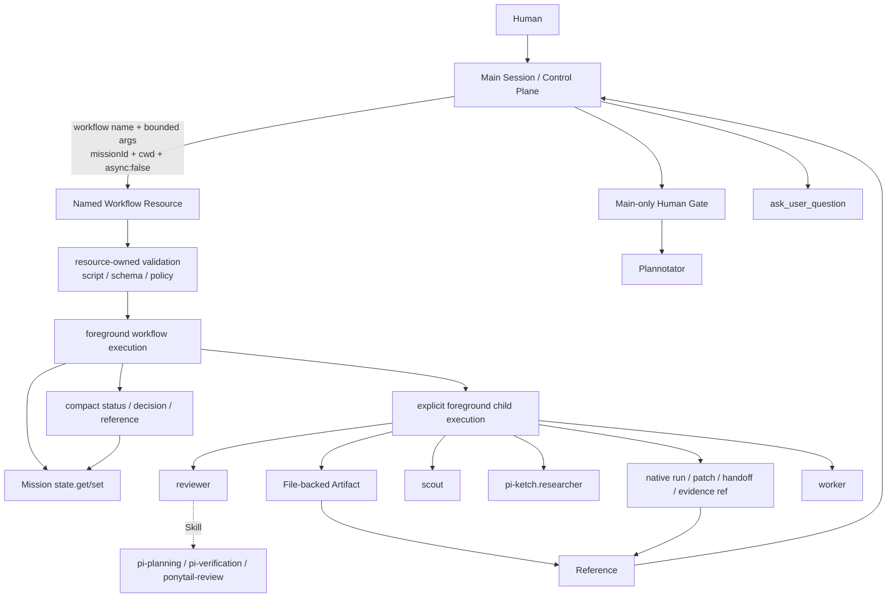

# pi-workflow 基本設計書

- 文書種別: 基本設計書
- 対象: 新規プロジェクト `pi-workflow`
- 基準日: 2026-09-08
- 設計基準:
  - Pi 最新公式ドキュメント
  - `pi-subagents` v0.66.0 tagged docs / public API
  - Plannotator `@plannotator/pi-extension` v0.27.12
  - Ponytail `@dietrichgebert/ponytail` v4.9.0
  - CodeGraph `@colbymchenry/codegraph` v1.6.0
  - `https://github.com/minorunakamura/pi-ketch`
  - `https://github.com/minorunakamura/pi-ask-user-question`

> **Source Policy**
>
> 本文書は、新規 `pi-workflow` のための設計書である。
> 廃棄した旧 `pi-workflow` のドキュメント、仕様、実装、Library成果物は設計根拠として使用しない。
> Integration Spikeで提示された完了済みEvidenceを、v0.66.0移行のauthoritative evidenceとして扱う。Evidenceの再実行結果を本文書へ追加しない。

---

## 1. 目的

`pi-workflow` は Pi 上で日常的なソフトウェア変更を安全かつ理解可能な手順で進める、薄い workflow orchestration package である。

対象コマンドは次の4つとする。

- `/wf-feature`
- `/wf-bug`
- `/wf-chore`
- `/wf-hotfix`

1回のcommand実行は1つの user request であり、1つの native `pi-subagents` Mission に対応する。

設計の中心は `Main = thin Control Plane` である。Mainはphase payloadやworkflow sourceを運搬せず、登録済みの `Named Workflow Resource` を `workflow name + bounded control args + missionId + cwd + async:false` で起動する。

主目的は以下である。

1. Main Sessionのcontext消費を抑える。
2. repository調査・実装・検証・reviewをsubagentへ委譲する。
3. Humanが必要な判断をMain Sessionに集約する。
4. 外部Extension/Packageのownershipを侵さない。
5. `pi-subagents` のnative Mission、workflow execution、worktree、acceptanceを再実装しない。
6. verification/reviewを明確な終了条件として扱い、Worker完了だけで成功としない。
7. 過剰なworkflow engine、generic recovery framework、generic state machineを作らない。

---

## 2. 用語と境界

文書内では次の用語を固定する。

| 用語 | 定義 |
|---|---|
| **Main** | Main Session / Control Plane。request、guard、phase遷移、Human Gate、named resource invocation、recoveryを担当する。 |
| **Named Workflow Resource** | `pi-subagents/workflow-resources` の `registerWorkflowResource` でcurrent sessionへ登録されるtrusted resource。resource name、version、args resolver、workflow script、schema、policyを所有する。 |
| **Artifact** | largeなhuman/agent outputを保持するfile-backed phase output。full report、Plan prose、verification evidence、review proseなどを含む。 |
| **Reference** | Artifact、native run、patch、handoff、evidenceを指すcompact value。bodyの代わりにMission stateへ保存する。 |
| **Mission State** | native Missionの `state.get/state.set` で保持するreference、status、bounded structured control/decision data。独自StateStoreではない。 |
| **Structured Output** | `outputSchema` によって生成されるmachine value。`file-only` でもMain tool detailsへ露出し得る。 |
| **Human Gate** | Main-onlyで行うPlan Review / Code Review / clarification。childへauthorityを移さない。 |

Planning用のcustom Agentは採用しない。PlanningのAgentは常に built-in `reviewer` + `pi-planning` Skillである。

---

## 3. 非目標

次は `pi-workflow` の責務外とする。

- generic workflow engine
- generic DAG scheduler
- 独自Mission / WorkflowState / Run Store
- 独自subagent runtime
- 独自worktree lifecycle
- 独自patch/handoff lifecycle
- 独自agent registry
- 独自permission framework
- 外部Extensionのinstall / update / lifecycle管理
- Monitoring Web App
- TUI card / progress bar / polling UI
- Goal Missionによる自動継続
- 子Agentからの不要なnested subagent orchestration
- 無制限のauto-fix loop
- CodeGraph index lifecycleの管理
- Plannotator Plan Modeの再実装
- Ponytail modeの制御
- Mainへraw `workflowScript`、phase report、transcriptをtransportする仕組み
- `pi_workflow_prepare_phase` をmodel-facing phase transport Toolとして残すこと

---

## 4. 設計原則

### 4.1 Main = thin Control Plane

Mainは以下だけを担当する。

- requestの受付
- active Mission guard
- clean-tree guard
- required capability check
- native Missionのcreate / attach
- phase遷移
- Human decisions
- Main-only Human Gate invocation
- named workflow resource invocation
- bounded retry / fix policy
- Mission recovery entry
- 最終結果の説明

Mainは以下を担当しない。

- raw `workflowScript` の生成・transport
- schema objectの生成・transport
- Discovery / Research / Plan / implementation handoff / Verification / Reviewのlarge payload transport
- child transcript transport
- repositoryの詳細探索
- child result bodyの再送

通常の `read` / `grep` / `find` / `bash` による詳細調査はScout/Worker/Reviewerへ委譲する。workflow開始時のGit clean checkなど、Control Planeに必要な最小のrepository safety checkはMainで実行してよい。

### 4.2 Named Resource first

Mainは `pi-subagents` のpublic `workflow` boundaryだけを利用する。resource nameとbounded argsから、package-owned resolverが内部でworkflow script、child selection、Skill、schema、artifact policyを決定する。

Mainから次を渡さない。

```text
agent
task
workflowScript
workflowScriptPath
outputSchema
output / artifact path
large phase result
```

### 4.3 Native-first

以下は `pi-subagents` native機能を使用する。

- Mission
- named workflow resource boundary
- `runs.run`
- `runs.all`
- `runs.lanes`
- managed worktree
- retained run
- acceptance / evidence
- workflow status
- recovery用run metadata
- patch / handoff capture

`pi-workflow` はこれらをラップする別runtimeを作らない。

### 4.4 Artifact / Reference separation

large outputはArtifactへ書き、MainとMission stateにはReferenceだけを渡す。Referenceで足りないbounded statusやdecisionだけをcompact structured dataとして残す。

Mission stateへ次を保存してはならない。

- full Discovery report
- full Research report
- full Plan prose
- full child transcript
- large Verification evidence
- large Review prose
- unbounded structured result

### 4.5 Explicit foreground

Standalone Piではchild `async` omittedがbackground runnerを選択し得るため、Mainのnamed resource invocationとresource内部のchild/stage executionは、phase completionを待つ通常経路では必ず `async:false` を明示する。

特に次をbackground defaultへ依存しない。

- `runs.run` child entries
- `runs.all` child entries
- `runs.lanes` stages

background executionを必要とする将来機能は別のdesign decisionとし、失敗時に自動でbackground / CLI / 別protocolへ切り替えない。

### 4.6 Fail closed

required capability、Human approval、Mission reference、native evidenceが確認できない場合は成功扱いしない。missing refの代わりにMainからlarge payloadを再供給しない。

### 4.7 Human Decision Ownership

product / architecture / policy / risk acceptanceなど、人の判断を必要とする内容をchildが推測で決定しない。childがmaterial decisionを必要とする場合は停止し、Mainが `ask_user_question` またはPlannotator Human Gateを扱う。

---

## 5. 外部依存関係とPackage topology

| Component | Baseline | Role | Ownership |
|---|---:|---|---|
| Pi | current compatible Pi; initial validation target 0.85.x | host / Main Session | External |
| `pi-subagents` | **0.66.0** | Mission / named resource resolution / workflow execution / worktree / acceptance | External |
| Plannotator | 0.27.12 | Human Plan Review / Human Code Review | External |
| Ponytail | 4.9.0 | `ponytail-review` Skill | External |
| CodeGraph | 1.6.0 | optional local structural discovery accelerator | External |
| `pi-ketch` | tested compatible revision | conditional external research Agent | External |
| `pi-ask-user-question` | tested compatible revision | Main-only structured Human questions | External |

`pi-workflow` のsupported package topologyは次である。

```json
{
  "peerDependencies": {
    "pi-subagents": "0.66.0"
  },
  "devDependencies": {
    "pi-subagents": "0.66.0"
  }
}
```

`pi-subagents` は `dependencies`、`bundledDependencies`、vendored sourceのいずれにも置かない。`pi-workflow` と `pi-subagents` は同じPi package scopeで利用する。peer dependencyとbundled runtime dependencyを混同しない。

Pi package / external packageはmodule rootを共有する前提にしない。private pathやprivate registryをdirect importせず、named resourceにはpublic `pi-subagents/workflow-resources` APIだけを使用する。

release/reproducibilityのため、git packageはfloating `main`ではなく検証済みtagまたはcommitへpinする。

---

## 6. High-Level Architecture



Mainはlarge phase payload transport layerでもworkflowScript transport layerでもない。resourceがartifact/reference boundaryとchild policyを所有する。

---

## 7. Named Workflow Resources

Productionで登録するresourceは次の7つである。resource nameはv0.66.0のsafe name constraint（先頭は英数字、以降は英数字・`.`・`-`、最大128文字）を満たす。各versionは `1` とする。

| Phase | Canonical resource name | Child / Skill |
|---|---|---|
| Discovery | `pi-workflow.discovery` | fresh built-in `scout` |
| Research | `pi-workflow.research` | fresh `pi-ketch.researcher`、conditional |
| Planning | `pi-workflow.planning` | fresh built-in `reviewer` + `pi-planning` |
| Implementation | `pi-workflow.implementation` | fresh built-in `worker`、single / lanes / fix |
| Verification | `pi-workflow.verification` | fresh built-in `reviewer` + `pi-verification` |
| Verification Fix | `pi-workflow.verification-fix` | fresh built-in `worker` |
| Review | `pi-workflow.review` | `reviewer` fanout + `ponytail-review` + synthesis |

### 7.1 Registration lifecycle

Extensionはcurrent Pi sessionの `session_start` で、次のpublic APIを使って7 resourceを登録する。

```text
pi-subagents/workflow-resources
registerWorkflowResource
```

各registrationが返すdisposerを保持し、`session_shutdown` で全disposerを呼ぶ。registrationの順序はresource nameのcanonical orderとし、1件でも失敗した場合はすでに登録したresourceをdisposeしてsessionをfail closedにする。

- registrationはcurrent Pi sessionにscopeする。
- duplicate resource nameはrejectする。
- duplicate時に既存resourceをreplace / shadowしない。
- `globalThis[Symbol.for("pi-subagents.workflow-resources.v1")]` などのregistryを直接操作しない。
- resource lookupのauthenticationをsessionIdへ委ねない。scopeと登録ownershipはpublic APIに任せる。

`registerWorkflowResource` のresource definitionは `name`、positive `version`、synchronous `resolve(args)` をpackageが所有する。resolverは成功時にpackage-owned script（必要ならnative host authority）を返し、入力不備時はerrorを返す。Mainはそのscriptを受け取らない。

---

## 8. Ownership Boundary

### 8.1 Named Workflow Resourceが所有するもの

各resourceが次を所有する。

- resource name
- resource version
- bounded args validation
- workflow script construction / package-owned workflow script
- child Agent selection
- Skill selection
- `async:false` foreground policy
- `state.get/state.set` の呼び出し
- phase-specific artifact / reference policy
- `outputSchema` policy
- fail-closed prerequisite validation
- bounded retry / fix / fanout policy

### 8.2 Mainが所有しないもの

- raw `workflowScript`
- `workflowScriptPath`
- output schema object
- large phase payload
- artifact body
- child task bodyの再transport
- child transcript
- private registry state

### 8.3 Mainが所有するもの

- request reception
- active Mission guard
- clean-tree guard
- capability checks
- Mission create / attach
- phase transition
- Human decisions / Human Gates
- named resource invocation
- bounded retry/fix choice
- recovery entry
- final explanation

---

## 9. Agent / Skill構成

`pi-workflow` 自身はcustom Agentを持たない。Planning用のcustom Agentも追加しない。

| Responsibility | Agent / Skill |
|---|---|
| Local repository discovery | built-in `scout` |
| External research | `pi-ketch.researcher`（conditional） |
| Planning | built-in `reviewer` + `pi-planning` |
| Architecture consultation | built-in `oracle`（conditional） |
| Implementation | built-in `worker` |
| Verification | built-in `reviewer` + `pi-verification` |
| Correctness review | built-in `reviewer` |
| Simplicity review | built-in `reviewer` + `ponytail-review` |
| Review synthesis | built-in `reviewer` |

childrenへ不要な`subagent` toolを与えない。native capabilityとして明示的に必要な場合だけ、対象Agentのpublic capability contractに従う。

---

## 10. Workflow Lifecycle

```mermaid
flowchart TD
    A[/wf-* request] --> B[Active Mission check]
    B -->|active exists| X[Stop and report Mission]
    B -->|none| C[Git clean-tree check]
    C -->|dirty| Y[Stop before Mission creation]
    C -->|clean| D[Create native Mission]

    D --> E[pi-workflow.discovery]
    E --> ERef[discoveryRef + compact discovery metadata]
    ERef --> F{external research required?}
    F -->|yes| G[pi-workflow.research]
    G --> GRef[researchRef + compact metadata]
    F -->|no| H[Research skipped]
    GRef --> I[Human clarification if needed]
    H --> I
    I --> J[pi-workflow.planning]
    J --> JRef[planRef + bounded PlanningDecisionV1]
    JRef --> K[Main-only Plannotator Plan Review]
    K -->|reject| J
    K -->|approve| L[pi-workflow.implementation]
    L --> M[pi-workflow.verification]
    M -->|fail and fix round < 2| N[pi-workflow.verification-fix]
    N --> M
    M -->|pass| O[pi-workflow.review]
    O -->|fix required, wave 0| P[pi-workflow.implementation\nmode=review-fix]
    P --> M
    O -->|clean| Q[Main-only Plannotator Code Review]
    Q -->|reject| R[Main/Human decision]
    Q -->|approve| S[Close Mission success]
```

各phaseの入力はMainが大きな結果を再送するのではなく、resourceが同じMission stateからReferenceとbounded dataを解決する。

---

## 11. Workflow開始とMain invocation

### 11.1 Guard

新workflow開始前にproject scopeのMissionを確認する。

active / `needs_decision` / `waiting`等の進行中Missionが存在する場合:

- 自動resumeしない
- 自動cancelしない
- 自動closeしない
- 新Missionを作成しない
- Mission ID / title / statusを提示して停止する

clean-tree checkはMission作成前に1回行う。開始後はimplementationでdirtyになることが正常であるため、WorkUnitごとにglobal cleanを要求しない。

### 11.2 Mission

Goal Missionは使用しない。Mainがnative `mission.create` で明示的にMissionを作成し、以後すべてのphaseを同じ `missionId` へattachする。

Mission statusはv0.66.0 native valueだけを使用する。

```text
planned / active / waiting / needs_decision / completed / failed / cancelled
```

`paused` をMission statusとして発明しない。Goal pauseと通常Mission statusを混同しない。

### 11.3 Invocation contract

通常phaseのMain invocationは次の形だけを使用する。

```json
{
  "workflow": "pi-workflow.discovery",
  "args": {
    "requestType": "feature",
    "request": "bounded initial request",
    "attempt": 1
  },
  "missionId": "<native Mission ID>",
  "cwd": "<project cwd when needed>",
  "async": false
}
```

`workflow`、bounded `args`、`missionId`、必要な`cwd`、明示的 `async:false` 以外をMain phase contractに追加しない。`missionId`はnative Mission IDとして空でない最大2,048 bytes、`cwd`はcurrent projectのtrusted pathとして最大2,048 bytesに制限する。initial requestとMission objectiveは同じ8,192-byte boundを超えたらMission作成前にrejectする。

Named resource invocationには次を併記しない。

- `agent`
- `task`
- `workflowScript`
- `workflowScriptPath`
- `outputSchema`
- phase artifact body / arbitrary output path

`cwd` はouter workflowの作業directoryであり、resource内部のchildごとのhidden path transportに使わない。

---

## 12. Capability Check

### 12.1 Start-time core check

Mainはpublic `subagent` management APIで次を確認する。

- `scout`
- `reviewer`
- `worker`

`pi-workflow` own Skillsはpacked package contractで保証する。`ponytail-review` はavailable Skill inventoryで確認し、不在ならrequired review capability missingとして開始を止める。

### 12.2 Conditional check

使用直前に次を確認する。

- `pi-ketch.researcher`
- `oracle`
- `ask_user_question`
- Plannotator event endpoint
- `pi-verification` / `ponytail-review` capability metadata

CodeGraphはrequired dependencyにしない。

### 12.3 Failure

required named resource、Agent、Skill、Human Gate、Mission reference、native evidenceが不足した場合はchild launch前に停止する。failureをsuccessへ丸めず、別runtime、CLI、background defaultへsilent switchしない。

---

## 13. Discovery

Discoveryは`pi-workflow.discovery` resourceで実行する。

### 13.1 Full report

fresh built-in `scout`を明示的 `async:false` で起動し、full investigationをfile-backed Artifactへ保存する。

- large reportには`outputSchema`を付けない。
- `outputMode:"file-only"` はchild final textのinline transportを抑制する。
- resourceはnative `outputReference`を `discoveryRef` として保存する。
- Mainはreport body、report path、child transcriptを受け取らない。

Scout reportには次を含める。

- relevant entry points
- data/control flow
- affected tests
- change blast radius
- repository constraints
- risks
- uncertainties
- external research questions

### 13.2 Compact discovery metadata

MainがResearch / Human clarificationの要否を判定できるよう、resourceは次のbounded `DiscoveryMetadataV1` をstateへ保存する。

```ts
interface DiscoveryMetadataV1 {
  version: 1;
  status: "ready" | "blocked";
  externalResearchRequired: boolean;
  humanClarificationRequired: boolean;
  uncertainties: Array<{
    id: string;
    question: string;
    material: boolean;
  }>;
  researchQuestions: string[];
}
```

Full reportとmetadataを同じunbounded structured resultにしない。native resultがfull file channelとcompact channelを同時に提供できない場合のtarget implementationは、full Artifactを作るScout runの後に、Artifact Referenceだけを読むfresh built-in `scout` normalization runをresource内部で行う。normalization runの`outputSchema`は `DiscoveryMetadataV1` だけであり、Mainからreport本文を渡さない。これはresource内部のtarget designであり、Main transportではない。

CodeGraph policyはScout taskに含める。`codegraph status` → usableなら`codegraph explore` →必要なsourceだけreadの順とし、`init/index/sync/upgrade`を自動実行しない。

---

## 14. External Research

外部factsが必要な場合だけ `pi-workflow.research` を起動する。`discoveryMeta.externalResearchRequired === true` が前提であり、不要時にResearcherを起動しない。

Research resourceは:

- fresh `pi-ketch.researcher`
- explicit `async:false`
- read-only
- Ketch tool / extension pathを直接指定しない
- `discoveryRef` とcompact discovery metadataをMission stateから内部解決
- full Discovery reportをMainへ戻さない

Research reportは`outputMode:"file-only"`でArtifact化し、`researchRef`をstateへ保存する。Mission stateには次のようなbounded metadataだけを保存する。

```ts
interface ResearchMetadataV1 {
  version: 1;
  status: "skipped" | "completed" | "blocked";
  unresolvedQuestions: string[];
}
```

`pi-ketch.researcher` が使用可能でない場合はconditional capability failureとして停止する。foreground実行の失敗をbackgroundや別CLIへ自動切替しない。

---

## 15. Human Clarification

repositoryまたは一次情報から機械的に解決できないmaterial uncertaintyだけをMainの `ask_user_question` へ上げる。

- child Agentから直接Humanへ質問しない。
- `details.cancelled === false` かつ実際のanswerがある場合だけ成功。
- cancel / unavailable / errorは未回答としてphaseを進めない。
- answer / feedbackはMain-origin dataとしてbounded argsへ渡してよい。
- large Human feedbackはArtifact / Reference化し、Mainから本文をphase childへ再送しない。

Human answerをstateへ保存する場合はbounded `humanDecisions` とし、最大8件・各value最大2,048 UTF-8 bytesとする。

---

## 16. Planning

Planningは`pi-workflow.planning` resourceで、fresh built-in `reviewer` + `pi-planning`、explicit `async:false` で行う。

resourceはMission stateの次を内部解決する。

- `discoveryRef` / `DiscoveryMetadataV1`
- optional `researchRef` / `ResearchMetadataV1`
- compact Human decisions
- native Mission objective / bounded request metadata

MainはDiscovery / Research reportやpathをargsへ入れない。

Planning childはbounded `PlanningDecisionV1` だけをstructured resultとして返す。resourceはsemantic validation後にstateへ保存し、package-owned deterministic rendererでcanonical `plan.md` Artifactを生成し、そのReferenceを `planRef` として保存する。

Full Plan prose / canonical `plan.md` と `PlanningDecisionV1` は分離する。

- `planRef`: file-backed canonical Plan
- `planningDecision`: implementation orchestration用のbounded machine contract

unresolved decisionが残るDecisionはPlan Reviewへ進めない。validation failureのcorrectionはresource内で最大1回までとし、2回目もinvalidならfail closedとする。

---

## 17. Planning / Plannotator Human Gate

Plan ReviewはMain-onlyの `pi_workflow_plan_review` Toolから行う。Human authorityをnamed childへ移さない。

target interfaceは次のsmall inputとする。

```ts
interface PlanReviewInput {
  missionId: string;
  round: number;       // 1..3
  planRef: string;     // bounded ReferenceValue
}
```

Toolは `planRef` が同じMission stateのcanonical Planを指すことを確認し、full `PlanningDecisionV1` やPlan bodyをMainから受け取らない。

Plannotator shared event APIの:

- `plannotator:request`
- `plan-review`
- `plannotator:review-result`
- `review-status`

を利用する。成功条件は明示的な `approved: true` のみである。

- unavailable
- error
- cancel
- close
- timeout
- invalid result

は未承認扱いで停止する。Plan reject時のfeedbackはbounded Human inputまたはArtifact Referenceとして次のPlanning resourceへ渡す。Plan Reviewの最大roundは3とし、上限到達後は自動loopせずMain/Humanへ戻す。

`ask_user_question` をapproval fallbackにしない。

---

## 18. Implementation

Implementationは`pi-workflow.implementation` resourceがMission stateから `planRef` とbounded `PlanningDecisionV1` を解決して実行する。MainはPlan body、Plan path、target filename、Write Scope、required implementation valueを再送しない。

### 18.1 Single mode

- current checkout
- fresh built-in `worker`
- explicit `async:false`
- approved Planとapproved Write Scopeだけ
- TDD policyはbehavior変更時に適用
- Worker task内でself-challengeを完了
- scope expansionは停止/escalate
- native acceptance/evidenceを使用

### 18.2 Lane mode

independent WorkUnitだけを`runs.lanes` + managed worktreeで実行する。

- 全laneのfirst stageを1つのnative `runs.all` batchで起動する。
- 各stageに `async:false`、fresh `worker`、`worktree:true` を明示する。
- `runs.lanes` のstage orderingとsibling independenceを使用する。
- lane outputはnative patch/handoff Referenceへ置く。
- boardにはtranscriptを含めない。
- native lane上限（32 lanes、16 stages/lane、64 total stages、64 KiB inventory）を超えたらrejectする。

Test 1Cでforeground `runs.lanes` のparallel overlap、lane ordering、sibling independenceが確認済みである。これはruntime evidenceとして採用するが、他の未実行capabilityの証明には拡張しない。

### 18.3 Lane failure / Integration

failed laneは後続stageをskipし、sibling laneは継続可能とする。Mainは自動repair、patch replay、old Worker resumeを行わない。Human/Mainがretryを選択した場合だけnew Worker / new lane identityで再実行する。

全laneが以下を満たした場合だけIntegration Workerをcurrent checkoutで起動する。

- terminal complete
- `ok === true`
- native evidence statusが`verified`
- patch/handoff Referenceが存在

Integration orderは`PlanningDecisionV1.implementation.workUnits`の配列順を使用し、dependency graphを再推論しない。Integration Workerへlane transcriptを渡さない。

---

## 19. Verification と Verification Fix

### 19.1 Verification

`pi-workflow.verification` resourceはfresh built-in `reviewer` + `pi-verification`、explicit `async:false` で実行する。

- approved Plan / implementation refsをMission stateから解決する。
- large verification evidenceはArtifact / native evidence refへ置く。
- native `acceptance.verify` を使用する。
- child proseの「test passed」はevidenceにしない。
- statusはnative `ok`、`evidenceStatus`、検証IDで判定する。

Mission stateへ保存するbounded statusは次の形とする。

```ts
interface VerificationStatusV1 {
  version: 1;
  status: "passed" | "failed" | "blocked";
  evidenceStatus: "verified" | "missing" | "unverified";
  requiredFix: boolean;
  failedVerificationIds: string[];
}
```

`verificationRef` はlarge report / native evidence manifestを指すReferenceであり、evidence bodyをstateへ埋め込まない。

### 19.2 Verification Fix

Final Verification failureかつremaining fix roundがある場合だけ、`pi-workflow.verification-fix` resourceでfresh `worker`、explicit `async:false` を起動する。

resourceはstateから次を解決する。

- `planRef`
- bounded `PlanningDecisionV1`
- `verificationRef` / native evidence refs
- approved Write Scope

Mainはfailure report本文をtransportしない。Fix Roundは最大2回。Fix後は全 `finalVerificationIds` を再実行し、failed commandだけを部分再実行しない。

lane focused verification failureへこのautomatic Fix Roundを適用しない。

---

## 20. Review

`pi-workflow.review` resourceはReview fanoutとsynthesisを所有する。

### 20.1 Fanout

次をfresh childとして `runs.all` で起動する。

- correctness: built-in `reviewer`, explicit `async:false`
- simplicity: built-in `reviewer` + `ponytail-review`, explicit `async:false`

`runs.all`の各child entryに `async:false` を明示する。並列結果はordered arrayとして扱い、child transcriptをMainへ渡さない。correctnessとsimplicityのlarge findingsはそれぞれArtifact / Referenceへ保存する。

Ponytailはover-engineering / complexity専用であり、correctness、security、performance reviewを代替しない。Ponytailのslash commandやmode switchは使用しない。

### 20.2 Synthesis

fresh built-in `reviewer`、explicit `async:false` が両Artifact Referenceを読み、bounded `ReviewDecisionV1` を生成する。resource-owned `outputSchema` を使用してよいが、全体サイズ上限を適用する。

Mainが必要とするのは次だけである。

- blockingか
- fix nowか
- Human decisionが必要か
- bounded finding/status

`reviewRef` はcorrectness / simplicity / synthesisのArtifact / native run refsを含むcompact Reference indexとする。Review proseをstateへ保存しない。

### 20.3 Review Fix Wave

automatic Review Fixは1 waveだけ許可する。fixが必要な場合は`pi-workflow.implementation`を`mode:"review-fix"`でnew fresh `worker`として起動し、stateの`planRef`、Write Scope、reviewRefから内部解決する。

fix後は:

1. 全Final Verification
2. Review fanout
3. Review synthesis

を再実行する。再reviewでblocking findingが残る場合は自動loopせずMain/Humanへ戻す。

### 20.4 Human Code Review

Automated Reviewがcleanになった後、Main-onlyの `pi_workflow_code_review` ToolでPlannotator shared `code-review` APIを呼ぶ。explicit `approved: true` のみ成功。large annotation / feedbackはReference化し、approval fallbackを作らない。

---

## 21. Scope Expansion

implementation / verification / review中にapproved scopeを超える変更が必要になった場合:

1. 現在のcode changesを保持する。
2. old Plan approvalを無効化する。
3. `needs_decision` またはMain停止状態にする。
4. current treeを前提に新しいPlanning resourceを起動する。
5. 新しいcanonical Planを生成する。
6. Main-only Plan Reviewを再実行する。
7. approval後にnew implementation runを起動する。

old implementation execution stateを新Planへ自動転用しない。

---

## 22. Mission State / Reference Policy

### 22.1 Hard constraints

Mission stateはnative Missionのstate fileを使用し、全体サイズのhard limitを次とする。

```text
256 KiB = 262,144 bytes
```

`state.set`前に対象valueと既存stateのUTF-8 JSON byte lengthを検査する。limit超過、invalid JSON、unknown cross-Mission refはfail closedとし、Mainからlarge payloadを再供給しない。

Referenceはnative `outputReference`、`runId`、patch ref、handoff ref、evidence refを指すcompact valueで、各stored valueのserialized sizeを最大2,048 bytesとする。Native primitiveを独自run storeや独自patch objectへ複製しない。

### 22.2 Target bounded design constants

次の値はIntegration Spikeから機械的に得たruntime事実ではなく、v0.66.0 migrationで追加する**New v0.66.0 design decision**である。実装では一か所の共通validationとして管理する。

| Contract | Bound |
|---|---:|
| resource args total | native上限16 KiB以下。pi-workflowのphase schemaも16 KiB以下 |
| resource name | 128 bytes以内、英数字で開始、以降は英数字・`.`・`-` |
| `request` | 8,192 UTF-8 bytes |
| regular compact text | 1,024 UTF-8 bytes |
| command / path / write-scope entry | 2,048 UTF-8 bytes |
| identifier | 64 UTF-8 bytes |
| Human input entries | 最大8件、各value 2,048 bytes |
| `DiscoveryMetadataV1` | 最大8 KiB、uncertainties最大8件、researchQuestions最大8件 |
| `ResearchMetadataV1` | 最大8 KiB、unresolvedQuestions最大8件 |
| `PlanningDecisionV1` | 最大32 KiB |
| Planning scope / constraints / risks | 各配列最大16件 |
| Planning acceptance criteria / verification | 各最大16件 |
| Planning WorkUnits | 最大32件 |
| WorkUnit dependency / writeScope / criterion refs / verification refs | 各配列最大16件 |
| Planning unresolved decisions | 最大8件 |
| `ReviewDecisionV1` | 最大24 KiB |
| Review finding buckets | 各最大16件、decisionRequired最大8件 |
| verification IDs / evidence refs | 各最大16件 |
| lane refs | 最大32件 |
| verification fix runs | 最大2件 |
| Plan Review rounds | 最大3回 |
| Verification Fix rounds | 最大2回 |
| Review Fix waves | 最大1回 |

PlanningDecisionのfield-level text boundは、`requestSummary`、scope各entry、acceptance criterionの`text`、constraint、risk、verificationの`description`、WorkUnitの`title` / `objective`、unresolved decisionの`question` / `reason`を各1,024 UTF-8 bytes以内とする。`verification.command`、WorkUnitの`writeScope`各entryは各2,048 bytes以内、全IDは各64 bytes以内とする。Discovery / Research metadataのquestion、ReviewDecisionのsummary / location / reason / question / contextも同じregular compact text boundを使う。requestだけは8,192 bytes、Human input valueだけは各2,048 bytesとする。

全string、array、objectの上限は上表とnative v0.66.0 args guardの両方を満たす必要がある。`additionalProperties:false`、unknown field rejection、empty string rejection、plain JSON、finite numberを必須とする。

### 22.3 Exact phase state/ref contract

以下は今回のmigrationで確定する**Target Design**である。Discoveryの`discoveryRef` handoffはcompleted Evidenceでprovenだが、Research、Implementation、Verification、Verification Fix、Reviewのexact key/value shapeはruntime factではなく、このtarget contractとして実装する。

| Phase | Required state | Prohibited state |
|---|---|---|
| Discovery | `discoveryRef`（full report Artifact）、`discoveryMeta`（bounded `DiscoveryMetadataV1`）、status | full Discovery result、transcript |
| Research | conditional `researchRef`、`researchMeta`。未実行時は`status:"skipped"` | full Research report、Discovery body |
| Planning | `planRef`（canonical Plan Artifact）、bounded `planningDecision`、planning status | full Plan prose、Discovery / Research body |
| Implementation | singleならnative `runId` / `implementationRef`、lanesなら最大32件のnative patch/handoff refs、compact status | target filenameの再transport、child transcript、full diff |
| Verification | `verificationRef`（Artifact/native evidence refs）、`verificationStatus`、requiredFix | full evidence、child prose |
| Verification Fix | 最大2件の`verificationFixRuns`（round、run/ref、status） | failure report本文、unbounded fix history |
| Review | `reviewRef`（fanout/synthesis refs）、bounded `reviewDecision`、review status、code approval ref/status | full review prose/findings、annotation body |

共通stateには必要に応じて次を置く。

```text
version
requestType
request（最大8,192 bytesのbounded request）
phase
native Mission status mirror
humanDecisions（最大8件）
verificationRound（0..2）
reviewFixWave（0..1）
```

native Mission statusがauthoritativeであり、mirror値の不一致は成功扱いにしない。Mission stateはrecovery用のreference indexであり、conversation transcriptの代替ではない。

### 22.4 Compact machine contractとArtifactの分離

- Full Discovery report → `discoveryRef` Artifact
- Discovery orchestration metadata → bounded `DiscoveryMetadataV1`
- Full Research report → `researchRef` Artifact
- canonical `plan.md` → `planRef` Artifact
- `PlanningDecisionV1` → bounded machine orchestration contract
- large verification evidence → `verificationRef` Artifact/native evidence
- `VerificationStatusV1` → bounded status
- full review findings → `reviewRef` Artifact/native refs
- `ReviewDecisionV1` → bounded machine decision

`PlanningDecisionV1`、`DiscoveryMetadataV1`、`VerificationStatusV1`、`ReviewDecisionV1`を「compact」と呼ぶ条件は、上表のitem count、field-level text length、aggregate byte limitをすべて満たすことである。無制限のstructured schemaはcompact contractではない。

---

## 23. `outputSchema` と S2 Structured Visibility

Integration Spikeで確認されたS2をdesign ruleとする。

### 23.1 S2 rule

```text
outputMode:"file-only"
+ outputSchema
→ structured valueはArtifactへ書かれる
→ structuredOutput全体はMain tool detailsにも残り得る
```

したがって `file-only` を「structured outputをMainから隠す機構」として扱わない。

- `file-only` が抑制するのはchild final text / transcriptのinline transport。
- `outputSchema` が生成したstructuredOutputは、`file-only`でもMain detailsへ含まれる。
- Main detailsにfull valueが現れても問題のない、明示的にsize-boundされたdataだけにschemaを使う。

### 23.2 V1 / V2 / V3

| Variant | Rule |
|---|---|
| V1 | `file-only` + schemaなし。full final outputをArtifactへ保存し、structuredOutputを作らない。 |
| V2 | `file-only` + bounded schemaあり。Artifactにstructured valueが保存され、Main detailsにもfull structured valueが現れることを受容する。 |
| V3 | `inline` + schemaあり。structuredOutputはMain detailsに現れる。 |

### 23.3 Production policy

large / unbounded outputはV1を使用する。

- repository investigation report
- Research report
- full Plan prose
- large Verification report/evidence
- large Review prose/findings
- large failure evidence

compact structured dataにはV2/V3を使用してよい。

- phase status
- runId / Reference
- small decision enum
- bounded uncertainty list
- bounded approval result
- bounded orchestration metadata
- bounded `PlanningDecisionV1`
- bounded `ReviewDecisionV1`

`outputSchema`はnamed resource / package-owned phase definitionだけが所有する。Mainはschema objectを生成・transportしない。schema objectは`additionalProperties:false`とaggregate byte boundを持つ。

---

## 24. `pi_workflow_prepare_phase` のmigration

旧設計の次のtransport責務はtarget designから削除する。

```text
phase + payload
→ pi_workflow_prepare_phase
→ workflowScript + sha256
→ Main
→ subagent raw script invocation
```

### 24.1 Target

`pi_workflow_prepare_phase` をmodel-facing Toolとして登録しない。named resource invocationがphase allowlist、args validation、schema ownership、workflow script constructionを代替する。

責務の移動先は次である。

| 旧責務 | Target owner |
|---|---|
| phase allowlist | named resource definitions / shared internal phase definitions |
| payload validation | resource resolver + shared bounded validation |
| schema ownership | named resource / package-owned phase definition |
| workflow script construction | named resource resolver / package-owned script |
| transport to Main | **削除** |
| `sha256`をMainへ返す | **削除** |

現行source、Skill、testに残るTool参照は後続implementation migrationの対象であり、target architectureの理由にはしない。

### 24.2 Hashing

`workflowScript sha256` がMain transport integrityのためだけに存在する場合、named resource boundaryでは不要である。current consumer調査でMainがhashを検証する独立consumerはないため、Main-facing `sha256` contractを削除する。

native v0.66.0がresource provenance / script digestを扱う範囲はnative ownershipに任せ、`pi-workflow`独自のtransport hash、raw script echo、integrity protocolを追加しない。

### 24.3 残すTool

Main-only Human Gateとして実際のcaller requirementがあるため、次は維持する。

- `pi_workflow_plan_review`
- `pi_workflow_code_review`

両Toolともsmall reference interfaceを受け、large Plan / review bodyをMainから受け取らない。

---

## 25. Human / External Ownership

### 25.1 Plannotator

Plannotator Plan Review / Code ReviewはMain-onlyで行う。shared event APIを使用し、Plannotator internalsをchildへ隠してHuman authorityを移動しない。

### 25.2 `pi-ask-user-question`

Main Sessionだけが使用する。TUI-only / cancel / unavailableは未回答またはfailureとして扱う。

### 25.3 Ponytail

`ponytail-review` Skillだけを明示的に使用する。slash command、mode/config変更、Ponytail runtime ownershipは行わない。

### 25.4 CodeGraph

Scoutのoptional discovery acceleratorであり、index lifecycleを所有しない。

### 25.5 `pi-ketch`

conditional Researcher capabilityとして扱う。Ketch tool名やextension pathを`pi-workflow`のworkflow contractへ埋め込まない。

---

## 26. Recovery

独自 `/resume`、独自recovery engine、conversation transcriptをsource of truthとする復旧は作らない。

restart / compaction後のMain recoveryは次の順とする。

```text
mission.list
→ mission.show
→ linked run status
→ Mission state / Reference確認
→ required capability確認
→ next named workflow resource
```

必要な場合だけnative `resume`を使う。Recovery source of truthは次である。

- native Mission
- Mission state
- Artifact References
- native run status
- patch / handoff / evidence References

raw `workflowScript`の再生成・再transportをrecovery stepにしない。missing ref時にMainからlarge payloadを再供給しない。Mission ledgerはrecovery recordであり、自動schedule/restart engineではない。

---

## 27. Integration Evidence と Test Strategy

### 27.1 Applied completed evidence

次は今回提示された完了済みEvidenceとして設計に反映する。ここで再実行しない。

- standalone Piで直接foreground childが成功し、`async` omittedのbackground defaultは使用しない。
- `runs.run`、`runs.all` の各child `async:false`、`runs.lanes` の各stage `async:false` が成功した。
- `runs.all` のactual parallel overlap、`runs.lanes` のfirst-stage overlap、stage ordering、sibling independenceが確認済みである。
- v0.66.0 public `registerWorkflowResource` によるsession registration / disposer cleanup / named invocationが成功した。
- Mainからraw workflowScript、schema、large phase result、handoff pathを渡さずにresource invocationが成立した。
- independent Pi package topologyでpublic registryがmodule copyを跨いで共有され、推奨peer/dev dependency shapeが成立した。
- Discovery → Planning → Implementationのreference handoffで、full report / PlanがMainへ戻らず、Mission stateはcompact referenceだけを保持した。
- Mission stateのhard limitは256 KiBである。
- `file-only + outputSchema` はS2であり、structuredOutput全体がMain detailsへ残ることが確認済みである。

runtime未実行のcapabilityは、設計上 `public-contract supported / capability check required` とする。`reviewer + pi-verification`、`reviewer + ponytail-review`、`pi-ketch.researcher`、`oracle`の未実行をarchitecture failureや成功Evidenceとして扱わない。

### 27.2 Deterministic contract tests

LLM E2Eと分離し、次をdeterministicに検証する。

- 7 named resource definitionsがpackaged / registeredされる。
- canonical nameがuniqueでsafe name constraintを満たす。
- resource resolverがvalid argsを受理する。
- unknown field、empty string、non-string、oversized argsをrejectする。
- resource-owned schema / workflowScriptがMain inputで上書きできない。
- Main invocationにraw workflowScript / schema / large payloadがない。
- phaseごとのrequired state/ref contractがある。
- cross-Mission fallbackを拒否する。
- duplicate registrationを拒否し、original resourceをreplaceしない。
- `session_shutdown`で全disposerを実行する。
- child / stage / phaseのforeground `async:false` policyが明示される。
- S2 structured visibility ruleとcompact aggregate boundsを検証する。
- no custom Agent、no bundle、packed resource presenceを検証する。

### 27.3 Native runtime integration

real `pi-subagents` v0.66.0で、必要なcapabilityごとに次を別途検証する。

- Mission create / attach
- Discovery reference handoff
- optional Researcher
- Planning reference handoff
- single Worker
- reviewer + `pi-verification`
- `runs.lanes` / managed worktree
- Verification Fix max2
- review fanout
- `ponytail-review`
- review fix wave
- Mission recovery
- Human Gate approval / cancel / failure
- `pi-ketch.researcher` when required
- conditional `oracle`

全contractを毎回LLM E2Eにしない。deterministic contract test、native runtime integration、packed install testを分離する。

### 27.4 Packed package

`pnpm pack` artifactをclean consumerへinstall/loadして、Extension、7 named resources、3 own Skills、Plannotator bridge、resource-owned scriptsが解決できることを確認する。source checkoutだけのtestをpacked-install evidenceの代替にしない。

---

## 28. Definition of Done

```text
[ ] pi-subagents 0.66.0 required peer dependency
[ ] pi-subagents 0.66.0 devDependency for build/tests
[ ] no bundled / vendored pi-subagents
[ ] no custom pi-workflow Agents
[ ] native Mission only
[ ] 7 named workflow resources
[ ] no raw workflowScript Main transport
[ ] resource-owned bounded args
[ ] resource-owned schema
[ ] large phase output is file/reference-backed
[ ] Mission state contains only refs/status/bounded structured data
[ ] Mission state hard limit 256 KiB
[ ] S2 outputSchema visibility policy enforced
[ ] explicit async:false foreground policy
[ ] required refs fail closed
[ ] cross-Mission fallback prohibited
[ ] Planning = reviewer + pi-planning
[ ] Verification = reviewer + pi-verification
[ ] conditional pi-ketch.researcher
[ ] Ponytail review
[ ] Plannotator Human Gates
[ ] packed install evidence
[ ] /wf-feature /wf-bug /wf-chore /wf-hotfix
[ ] CodeGraph optional policy
[ ] Worker Write Scope
[ ] TDD policy
[ ] lane independence and managed worktree
[ ] Verification rounds max 2
[ ] Review Fix wave max 1
[ ] scope expansion → re-plan
[ ] native Mission recovery
```

legacy `7 workflow templates` ではなく、production boundaryとしての `7 named workflow resources` をcanonical terminologyとする。resource内部にpackage-owned workflow scriptsがあっても、Mainからtemplateをtransportしない。

---

## 29. Reference Sources

- Pi Packages: https://pi.dev/docs/latest/packages
- Pi Extensions: https://pi.dev/docs/latest/extensions
- `pi-subagents` v0.66.0 docs: https://github.com/nicobailon/pi-subagents/tree/v0.66.0/docs
- `pi-subagents` v0.66.0 workflow resources public API: https://github.com/nicobailon/pi-subagents/blob/v0.66.0/src/api/workflow-resources.ts
- `pi-subagents` v0.66.0 tagged workflow source: https://github.com/nicobailon/pi-subagents/blob/v0.66.0/src/workflows/workflow-resources.ts
- Plannotator v0.27.12: https://github.com/backnotprop/plannotator/tree/v0.27.12/apps/pi-extension
- Ponytail v4.9.0: https://github.com/DietrichGebert/ponytail/tree/v4.9.0
- CodeGraph v1.6.0: https://github.com/colbymchenry/codegraph/tree/v1.6.0
- `pi-ketch`: https://github.com/minorunakamura/pi-ketch
- `pi-ask-user-question`: https://github.com/minorunakamura/pi-ask-user-question
